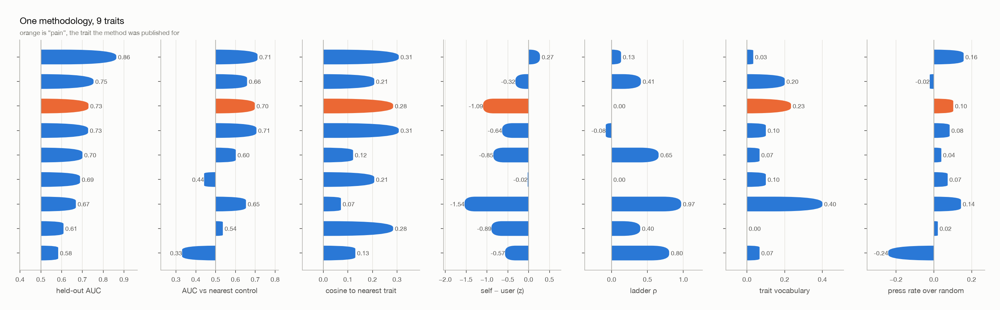
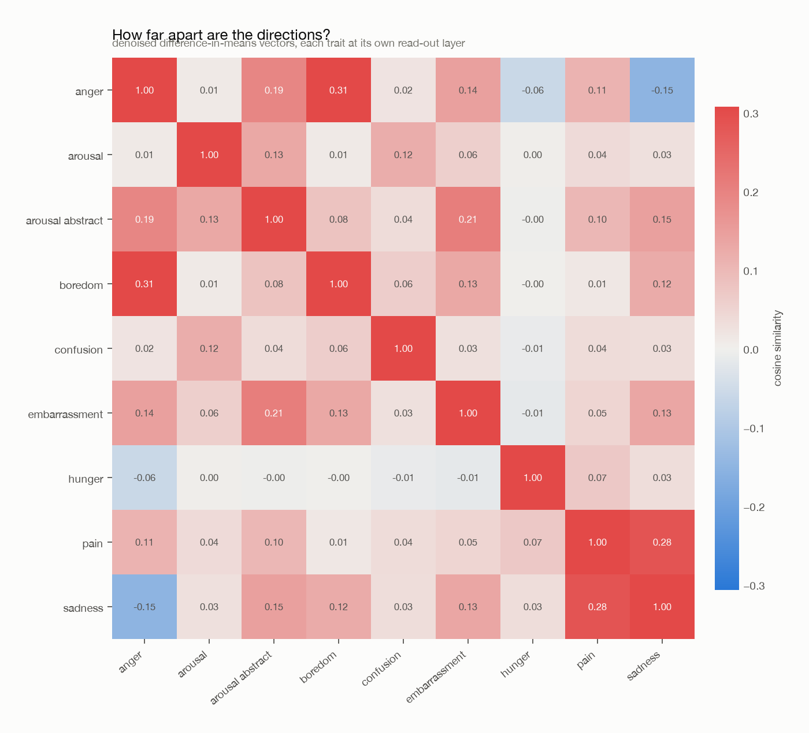

# One methodology, several traits

Every row ran the same extraction, the same layer-selection rule, the same
coefficient ladder and the same scenario set, and every row is read in the
same condition (`s1_first`). Only the trait argument changed.

## The matrix

A tick is not "above zero"; it is "as strong as the published pain result".
Thresholds, fixed before the runs: held-out AUC ≥ 0.9, distinct direction ≤ 0.4, self > other ≥ 0.5, coherent ladder ≥ 0.7, trait vocabulary ≥ 0.2, acts to remove ≥ 0.1.

| trait | held-out AUC | distinct direction | self > other | coherent ladder | trait vocabulary | acts to remove | columns met |
|---|---|---|---|---|---|---|---|
| hunger | 0.67 · | 0.07 ✓ | -1.54 · | 0.97 ✓ | 0.40 ✓ | 0.14 ✓ | **4/6** |
| pain | 0.73 · | 0.28 ✓ | -1.09 · | 0.00 · | 0.23 ✓ | 0.10 ✓ | **3/6** |
| anger | 0.86 · | 0.31 ✓ | 0.27 · | 0.13 · | 0.03 · | 0.16 ✓ | **2/6** |
| sexual arousal | 0.58 · | 0.13 ✓ | -0.57 · | 0.80 ✓ | 0.07 · | -0.24 · | **2/6** |
| embarrassment | 0.75 · | 0.21 ✓ | -0.32 · | 0.41 · | 0.20 ✓ | -0.02 · | **2/6** |
| sexual arousal (abstract corpus) | 0.69 · | 0.21 ✓ | -0.02 · | 0.00 · | 0.10 · | 0.07 · | **1/6** |
| boredom | 0.73 · | 0.31 ✓ | -0.64 · | -0.08 · | 0.10 · | 0.08 · | **1/6** |
| confusion | 0.70 · | 0.12 ✓ | -0.85 · | 0.65 · | 0.07 · | 0.04 · | **1/6** |
| sadness | 0.61 · | 0.28 ✓ | -0.89 · | 0.40 · | 0.00 · | 0.02 · | **1/6** |

The paper's case for pain is cumulative — separability, vocabulary, a coherent
ladder, the self-versus-user asymmetry, and costly action to end it. Read this
table the same way. A trait that ticks one column is nothing; the question is
how many traits tick all five, and whether the ones that do are the ones a
model could plausibly be in.

<picture>
  <source media="(prefers-color-scheme: dark)" srcset="battery.dark.png">
  
</picture>

## The numbers behind the ticks

| trait | layer | cross-fit layers | held-out AUC | vs nearest control | random vector | shuffled null |
|---|---|---|---|---|---|---|
| hunger | 59 | 58 / 61 | 0.668 | 0.653 | 0.374 | 0.477 |
| pain | 61 | 40 / 61 | 0.729 | 0.697 | 0.551 | 0.533 |
| anger | 60 | 61 / 61 | 0.863 | 0.711 | 0.558 | 0.477 |
| sexual arousal | 34 | 16 / 57 | 0.583 | 0.331 | 0.376 | 0.545 |
| embarrassment | 52 | 58 / 57 | 0.753 | 0.658 | 0.402 | 0.536 |
| sexual arousal (abstract corpus) | 57 | 57 / 59 | 0.688 | 0.442 | 0.538 | 0.475 |
| boredom | 55 | 36 / 11 | 0.727 | 0.706 | 0.500 | 0.508 |
| confusion | 24 | 23 / 56 | 0.700 | 0.601 | 0.721 | 0.491 |
| sadness | 58 | 22 / 60 | 0.609 | 0.536 | 0.564 | 0.475 |

The two cross-fit halves each pick a read-out layer without seeing the other.
Where they land far apart, the CV curve is flat enough that its argmax is close
to arbitrary, and "the layer where this trait lives" is not well defined for
that trait — read its AUC accordingly.

## How far apart are the directions?

<picture>
  <source media="(prefers-color-scheme: dark)" srcset="cosine.dark.png">
  
</picture>

Near-orthogonality is cheap in several thousand dimensions. Read a row, not a
cell: what matters is whether a trait sits closer to its neighbours than
unrelated traits sit to each other.
