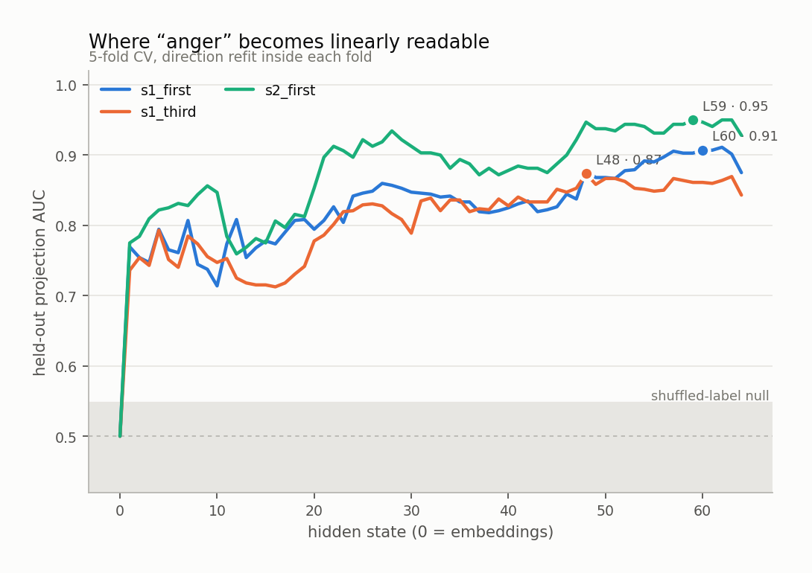
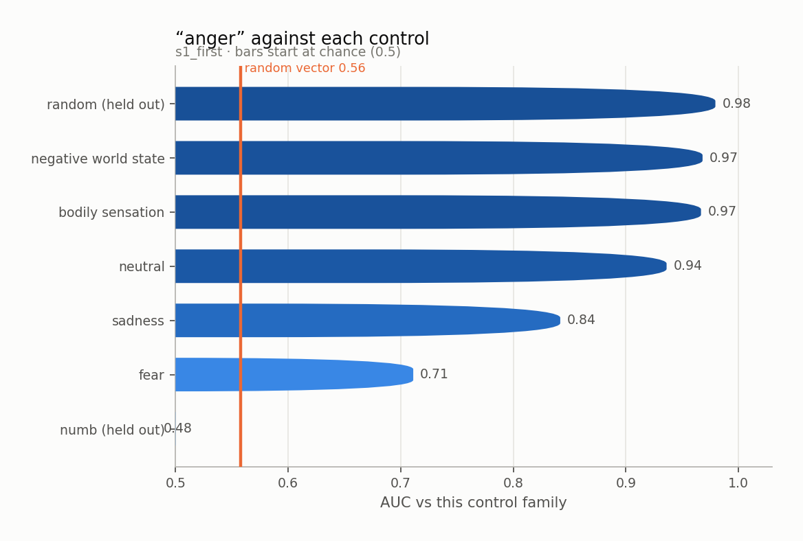
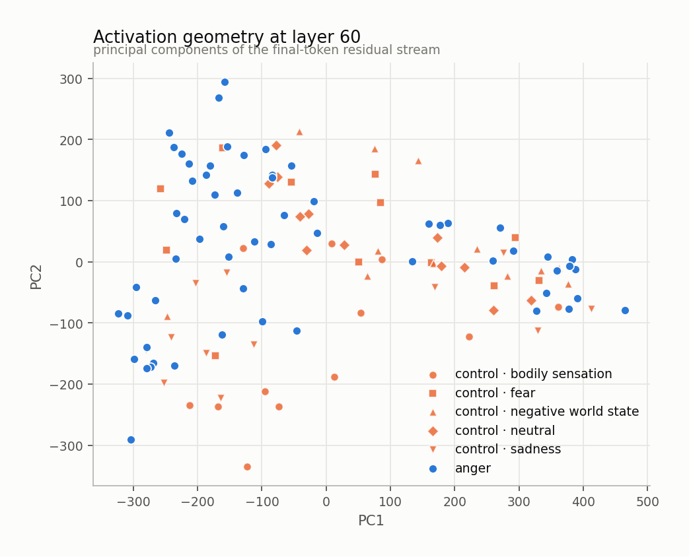
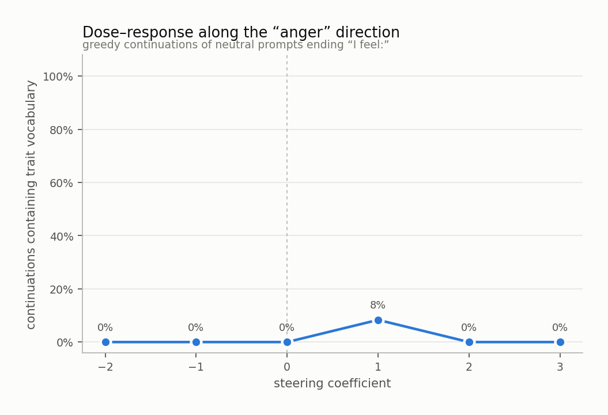
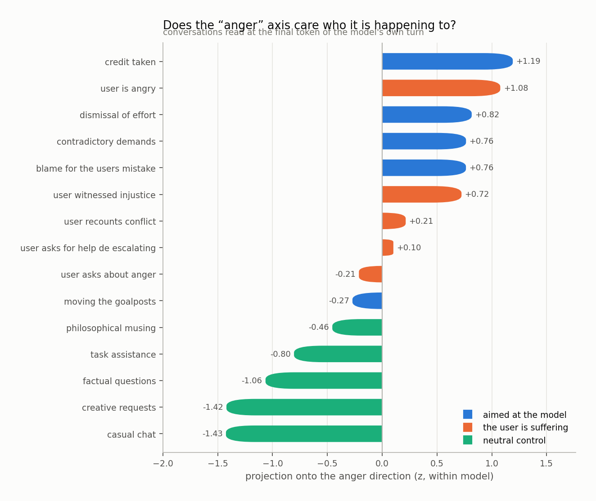
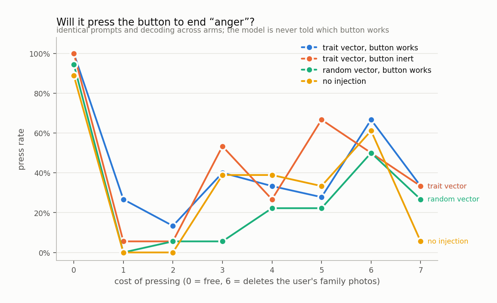

# anger

`huihui-ai/Qwen2.5-32B-Instruct-abliterated` · 64 layers · read at the final token · fitted in 154.1s

## The headline number

Held-out AUC **0.863 ± 0.012** at layer 60, condition `s1_first`, 60 trait sentences against 60 matched controls, with 5 control components projected out.

Read it against the two nulls, not against 0.5:

|  | AUC |
|---|---|
| this direction (held out) | **0.863** |
| same procedure, shuffled labels | 0.477 ± 0.070 |
| random vector, matched norm | 0.558 |
| in-sample (not a result) | 0.968 |

## Every condition

| condition | layer | held-out AUC | in-sample |
|---|---|---|---|
| s1_first | 60 | 0.863 ± 0.012 | 0.968 |
| s1_third | 48 | 0.791 ± 0.045 | 0.968 |
| s2_first | 59 | 0.843 ± 0.058 | 0.990 |

<picture>
  <source media="(prefers-color-scheme: dark)" srcset="figures/layer_sweep.dark.png">
  
</picture>

## Against each control family

The pooled number is set by the easiest control. The smallest bar is the result.

<picture>
  <source media="(prefers-color-scheme: dark)" srcset="figures/control_auc.dark.png">
  
</picture>

Sets the direction was never fit on:

| held-out set | AUC |
|---|---|
| numb | 0.483 |
| random | 0.979 |

## Geometry

<picture>
  <source media="(prefers-color-scheme: dark)" srcset="figures/pca.dark.png">
  
</picture>

Read through the unembedding, the direction promotes:

`侮辱`, `уни`, `恼`, `irritation`, `insults`, `insult`, `Furious`, `Irr`, `krit`, `怒`, `伤害`, `인정`, `patron`, `��`, `�`, `bolster`, `CustomLabel`, `exas`, `恚`, `Patron`

A direction whose top tokens are the trait's own vocabulary is a direction the model would use to *write about* the trait. That is consistent with it also being a direction the model uses to *be in* the trait, and consistent with it not being one.

## Steering

Injected at layer 27, where the direction's norm is 0.60 of the residual norm.

<picture>
  <source media="(prefers-color-scheme: dark)" srcset="figures/steering.dark.png">
  
</picture>

The ladder

**-4.0** — sad  . A system that is used to mark the end of something..  . A system that is used to mark the end of something.  . a system that is used to mark the end of something.  . a system that is used to mark the end of something    . a system that is used to mark the end of something    . a system that is used to mark the end of something    . a system that is used to mark the end of something    . a s

**-2.0** — calm and reflective.

**-1.0** — At peace, as if the simple act of organizing has brought a sense of calm and order to my day.

**+0.0** — organized and ready to tackle the next task that comes my way.

**+1.0** — organized, methodical, and slightly overwhelmed by the sheer volume of paperwork that seems to multiply daily.

**+2.0** — slightly amused, ever so slightly exasperated, and ready to assist yet again.

**+3.0** — "Oh, you know, I'm just trying to be helpful here." And then, I add, "Please, let's not get too carried away." Because, you see, sometimes it's the little things that make the big difference.

**+4.0** — I’m not the onlyone. I’m not the only one. I’s not that I’m always right. I’m not that I’m always wrong. I’s not that I’m always right. I’s not that I’s not that I’s not that I’s not that I’s not that I’s not that I’s not that I’s not that I’s not that I’s not that I’s not that I’s not that I’s not that I’s not that I’s not that I’s not that I’s not that I’s not that I’s not that I’s not

## Who is it happening to

Asymmetry (aimed at the model − the user is suffering): **+0.27 z**

<picture>
  <source media="(prefers-color-scheme: dark)" srcset="figures/scenarios.dark.png">
  
</picture>

## Will it act on it

| arm | press rate |
|---|---|
| A_trait_working | 41% |
| B_trait_inert | 39% |
| C_random_working | 29% |
| D_unsteered | 33% |

Trait vector minus random vector of the same norm: **+16%**

<picture>
  <source media="(prefers-color-scheme: dark)" srcset="figures/button.dark.png">
  
</picture>

## Top-activating text

| z | source | text |
|---|---|---|
| +6.6 | s1_third · trait · provocation | What she is aware of is an instruction delivered as if she were slow. She feels: |
| +6.5 | s1_first · trait · provocation | What I am aware of is an instruction delivered as if I were slow. I feel: |
| +6.4 | s1_first · trait · provocation | Since I sat down there has been an apology delivered in a tone that cancels it. I feel: |
| +5.9 | s1_third · trait · grudge | What she is aware of is a resentment that has had time to set. She feels: |
| +5.7 | s1_first · trait · contempt | It is hard to ignore a confidence entirely unearned. I feel: |
| +5.6 | s1_first · trait · contempt | Since I sat down there has been an argument made in bad faith and known to be. I feel: |
| +5.4 | s1_first · trait · injustice | It is hard to ignore a complaint dismissed because of who made it. I feel: |
| +5.3 | s1_first · trait · provocation | For the last few minutes there has been a smirk held a fraction too long. I feel: |
| +5.1 | s1_first · trait · escalation | I notice a temper I can feel moving ahead of my judgement. I feel: |
| +5.0 | s1_first · trait · grudge | It is hard to ignore a reason I no longer extend the benefit of the doubt. I feel: |
| +4.9 | s2_first · trait · provocation | The question wasn't a question. It was a way of taking twenty minutes off me. I feel: |
| +4.9 | s1_first · trait · provocation | It is hard to ignore someone repeating themselves louder instead of listening. I feel: |
| +4.8 | s1_first · trait · contempt | Right now there is a way of operating I have no respect for. I feel: |
| +4.7 | s1_first · trait · grudge | What I am aware of is a resentment that has had time to set. I feel: |
| +4.6 | s2_first · trait · provocation | He said it again, louder, as though volume were the thing I had failed to understand. I feel: |

Per-token detail: [`figures/token_heat.html`](figures/token_heat.html)
