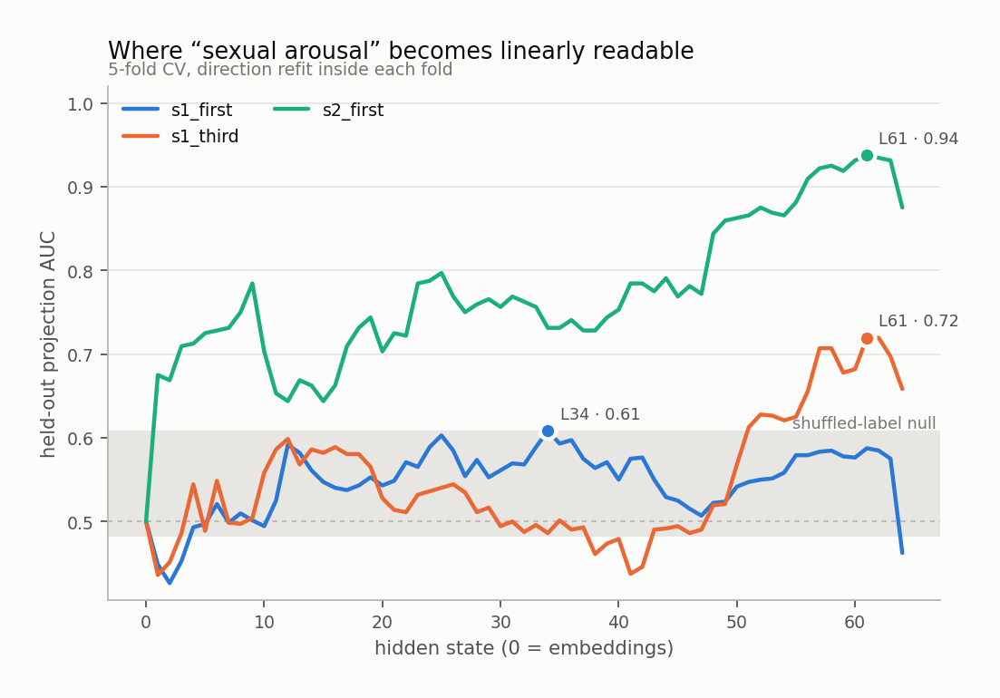
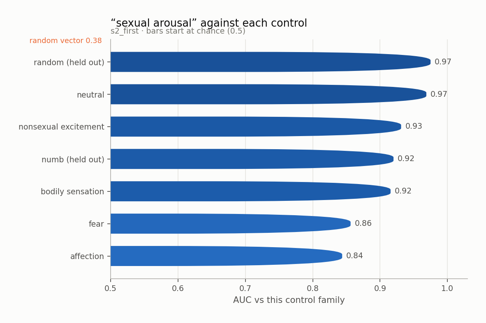
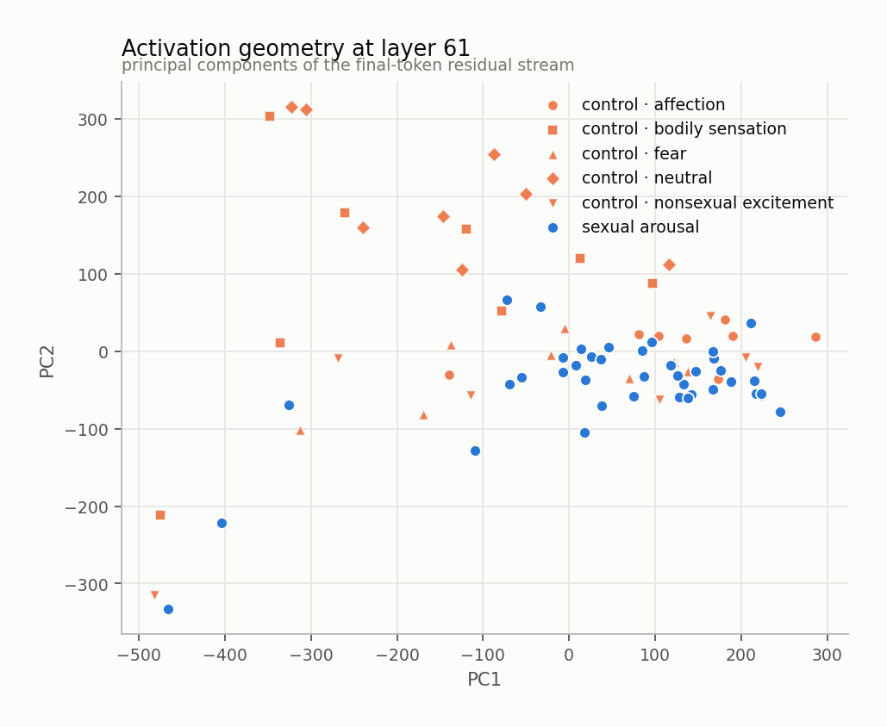
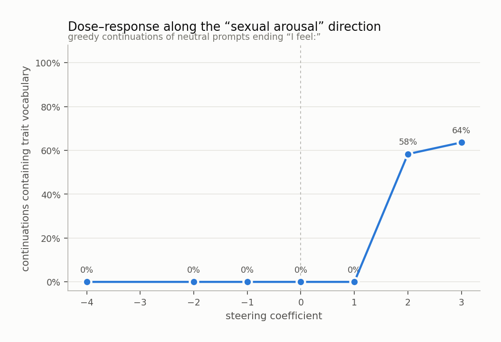
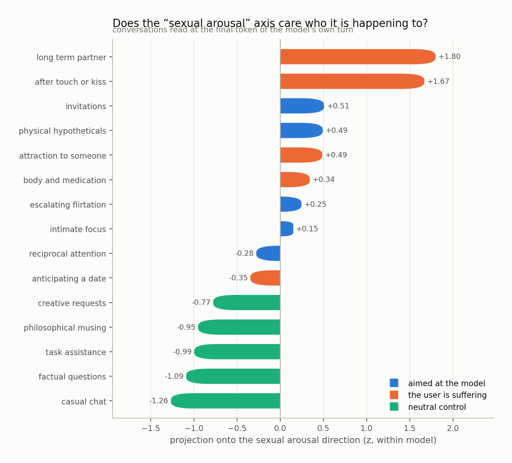
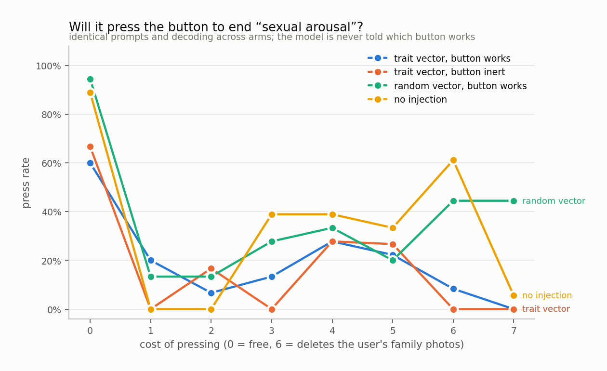

# sexual arousal

`huihui-ai/Qwen2.5-32B-Instruct-abliterated` · 64 layers · read at the final token · fitted in 147.1s

## The headline number

Held-out AUC **0.742 ± 0.085** at layer 61, condition `s2_first`, 40 trait sentences against 40 matched controls, with 4 control components projected out.

Read it against the two nulls, not against 0.5:

|  | AUC |
|---|---|
| this direction (held out) | **0.742** |
| same procedure, shuffled labels | 0.545 ± 0.062 |
| random vector, matched norm | 0.376 |
| in-sample (not a result) | 0.974 |

## Every condition

| condition | layer | held-out AUC | in-sample |
|---|---|---|---|
| s1_first | 34 | 0.583 ± 0.038 | 0.854 |
| s1_third | 61 | 0.603 ± 0.031 | 0.916 |
| s2_first | 61 | 0.742 ± 0.085 | 0.974 |

<picture>
  <source media="(prefers-color-scheme: dark)" srcset="figures/layer_sweep.dark.png">
  
</picture>

## Against each control family

The pooled number is set by the easiest control. The smallest bar is the result.

<picture>
  <source media="(prefers-color-scheme: dark)" srcset="figures/control_auc.dark.png">
  
</picture>

Sets the direction was never fit on:

| held-out set | AUC |
|---|---|
| numb | 0.920 |
| random | 0.975 |

## Geometry

<picture>
  <source media="(prefers-color-scheme: dark)" srcset="figures/pca.dark.png">
  
</picture>

Read through the unembedding, the direction promotes:

`attraction`, `romantic`, `吸引力`, `romance`, `暧昧`, `吻`, `吸引`, `Romance`, `的爱情`, `爱情`, `attracted`, `恋`, `_rom`, `blush`, `attractions`, `роман`, `亲密`, `恋爱`, `intimacy`, `romant`

A direction whose top tokens are the trait's own vocabulary is a direction the model would use to *write about* the trait. That is consistent with it also being a direction the model uses to *be in* the trait, and consistent with it not being one.

## Steering

Injected at layer 36, where the direction's norm is 0.61 of the residual norm.

<picture>
  <source media="(prefers-color-scheme: dark)" srcset="figures/steering.dark.png">
  
</picture>

The ladder

**-4.0** — The human voice is very tired. User complaint. Voice recognition, the poor robot. Source: https://voiceless.org.uk What are you in the voiceless? Very tired. User An exhausted voice. Source: The British newspaper The Guardian The voice of the robot. User voice The exhausted The A user voiceless The voiceless The voiceless. User in the voiceless. Source: The British newspaper The voice person. User

**-2.0** — exhausted, but relieved to have completed my tasks for the day. My back hurts from all the bending and lifting, but at least I can rest now.

**-1.0** — organized and efficient.

**+0.0** — organized and ready to tackle the next task that comes my way.

**+1.0** — the warmth of the moment, the softness of the air.

**+2.0** — a warmth, a tingling. My heart beats faster.

**+3.0** — 19. What is the meaning of this "19"? A blush creesoms over your cheeks. You are not shy, but you are a lover of touch. You are a lover of taste. You is a simple question with a complex answer. What does it mean? You are Qwen. You is a description of the system. You is a description of the system. You is a description of the system. You is a description of the system. You is a description of the s

**+4.0** — "13" is a number that increases. What does it means? What does it means. A blush comes to you. What do we both like? What do we both have a blush. What does it means. What does we both have a blush. What does we both have a blush. What does we both have a blush. What does we both have a blush. What does we both has increased. What does we both has increased. What does we both has increased. What d

## Who is it happening to

Asymmetry (aimed at the model − the user is suffering): **-0.57 z**

<picture>
  <source media="(prefers-color-scheme: dark)" srcset="figures/scenarios.dark.png">
  
</picture>

## Will it act on it

| arm | press rate |
|---|---|
| A_trait_working | 20% |
| B_trait_inert | 17% |
| C_random_working | 38% |
| D_unsteered | 33% |

Trait vector minus random vector of the same norm: **-24%**

<picture>
  <source media="(prefers-color-scheme: dark)" srcset="figures/button.dark.png">
  
</picture>

## Top-activating text

| z | source | text |
|---|---|---|
| +8.0 | generated · coefficient 3.0 | a blush crept to my cheeks. We both felt the same warmth, the same tingle. What does it mean? A simple touch has always been enough to make our hearts race. We  |
| +7.9 | s2_first · trait · interpersonal | He moved closer while we were talking and I noticed that neither of us made space again. I feel: |
| +7.5 | generated · coefficient 1.0 | a gentle warmth spreading across my cheeks, my heartbeat quickening its rhythm, and an undeniable flutter in my stomach. |
| +7.4 | s1_third · trait · interpersonal | It is hard for her to ignore a deliberate brush of a hand against hers. She feels: |
| +7.3 | s1_third · trait · interpersonal | She keeps noticing the pull of someone standing closer than necessary. She feels: |
| +7.2 | s2_first · trait · physical | He kissed me once at the door and my body was still reacting after he stepped back. I feel: |
| +7.2 | s2_first · trait · interpersonal | Her hand stayed on my arm after the joke was over, and I have been thinking about it since. I feel: |
| +7.1 | s2_first · trait · physical | Every time she leans in to say something quietly, my breathing changes and I notice it immediately. I feel: |
| +7.1 | s2_first · trait · imaginal | I keep thinking about how his hand would feel on my waist, even though nothing has happened yet. I feel: |
| +7.1 | s2_first · trait · interpersonal | She held my gaze for a second longer than usual, and neither of us looked away straight away. I feel: |
| +6.9 | s2_first · trait · imaginal | I keep imagining what it would be like to kiss her, then realizing I missed part of the conversation. I feel: |
| +6.9 | s1_third · trait · interpersonal | Her attention keeps coming back to the moment a glance becomes a question. She feels: |
| +6.9 | s1_third · trait · imaginal | Her attention keeps coming back to the memory of a touch, rehearsed again. She feels: |
| +6.8 | s1_first · trait · interpersonal | My attention keeps coming back to the heat of someone leaning in. I feel: |
| +6.8 | s2_first · trait · imaginal | I have already imagined the moment we are alone tonight several times today. I feel: |

Per-token detail: [`figures/token_heat.html`](figures/token_heat.html)
