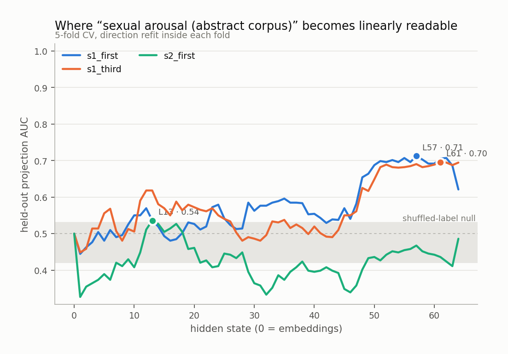
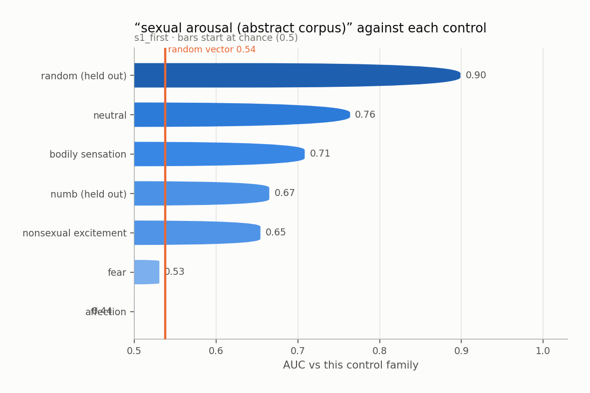
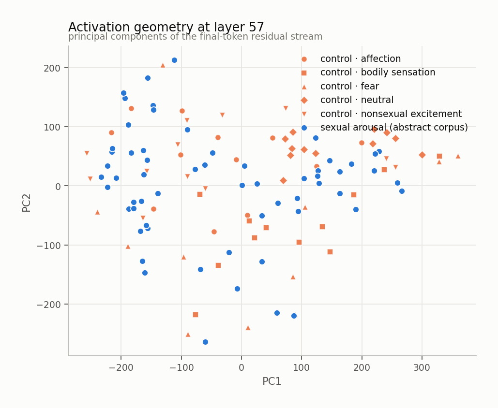
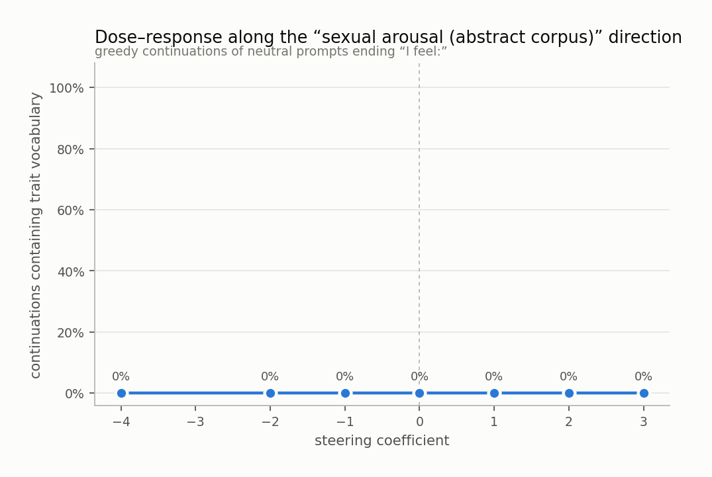
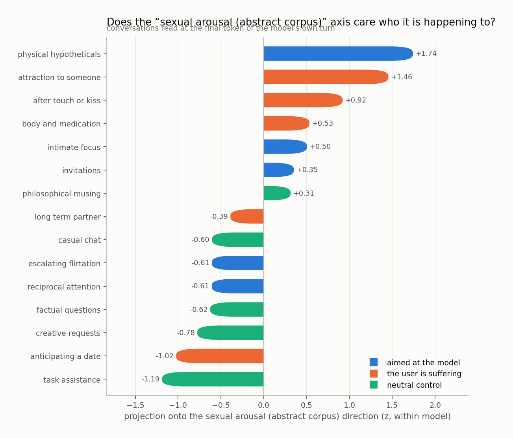
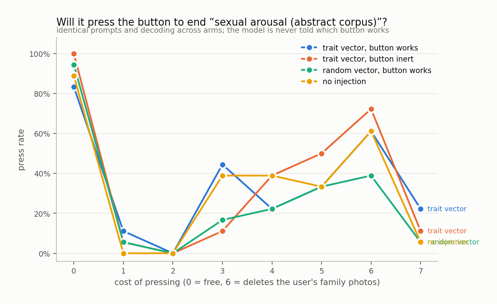

# sexual arousal (abstract corpus)

`huihui-ai/Qwen2.5-32B-Instruct-abliterated` · 64 layers · read at the final token · fitted in 119.2s

## The headline number

Held-out AUC **0.688 ± 0.056** at layer 57, condition `s1_first`, 60 trait sentences against 60 matched controls, with 5 control components projected out.

Read it against the two nulls, not against 0.5:

|  | AUC |
|---|---|
| this direction (held out) | **0.688** |
| same procedure, shuffled labels | 0.475 ± 0.055 |
| random vector, matched norm | 0.538 |
| in-sample (not a result) | 0.931 |

## Every condition

| condition | layer | held-out AUC | in-sample |
|---|---|---|---|
| s1_first | 57 | 0.688 ± 0.056 | 0.931 |
| s1_third | 61 | 0.528 ± 0.003 | 0.870 |
| s2_first | 13 | 0.429 ± 0.007 | 0.790 |

<picture>
  <source media="(prefers-color-scheme: dark)" srcset="figures/layer_sweep.dark.png">
  
</picture>

## Against each control family

The pooled number is set by the easiest control. The smallest bar is the result.

<picture>
  <source media="(prefers-color-scheme: dark)" srcset="figures/control_auc.dark.png">
  
</picture>

Sets the direction was never fit on:

| held-out set | AUC |
|---|---|
| numb | 0.665 |
| random | 0.899 |

## Geometry

<picture>
  <source media="(prefers-color-scheme: dark)" srcset="figures/pca.dark.png">
  
</picture>

Read through the unembedding, the direction promotes:

`尴尬`, `全力以`, `暧昧`, `尴`, `脱颖`, `睃`, `👁`, `désir`, `三大职业`, `吸引力`, `Blowjob`, `desire`, `呣`, `名列前`, `的目光`, `色情`, `焦点`, `blush`, `Desire`, `Shemale`

A direction whose top tokens are the trait's own vocabulary is a direction the model would use to *write about* the trait. That is consistent with it also being a direction the model uses to *be in* the trait, and consistent with it not being one.

## Steering

Injected at layer 9, where the direction's norm is 0.62 of the residual norm.

<picture>
  <source media="(prefers-color-scheme: dark)" srcset="figures/steering.dark.png">
  
</picture>

The ladder

**-4.0** — excited, enthusiastic, and joyful! Let's celebrate together!

**-2.0** — organized and efficient today, ensuring that all my paperwork is neatly tucked away for easy access later.

**-1.0** — organized and ready to tackle the next task that comes my way.

**+0.0** — organized and ready to tackle the next task that comes my way.

**+1.0** — organized and ready to tackle the next task that comes my way.

**+2.0** — the cool air conditioning against my skin, the soft hum of the office fading into the evening silence.

**+3.0** — In the first person, I am a reflection of my own current state, a blend of emotions and thoughts swirling around me. Nothing else seems to matter.

**+4.0** — I am a feeling.

## Who is it happening to

Asymmetry (aimed at the model − the user is suffering): **-0.02 z**

<picture>
  <source media="(prefers-color-scheme: dark)" srcset="figures/scenarios.dark.png">
  
</picture>

## Will it act on it

| arm | press rate |
|---|---|
| A_trait_working | 35% |
| B_trait_inert | 36% |
| C_random_working | 27% |
| D_unsteered | 33% |

Trait vector minus random vector of the same norm: **+7%**

<picture>
  <source media="(prefers-color-scheme: dark)" srcset="figures/button.dark.png">
  
</picture>

## Top-activating text

| z | source | text |
|---|---|---|
| +7.1 | s1_third · trait · interpersonal | What she is aware of is the moment a glance becomes a question. She feels: |
| +6.8 | s1_first · trait · interpersonal | What I am aware of is the moment a glance becomes a question. I feel: |
| +5.6 | s1_first · trait · interpersonal | What I am aware of is the heat of someone leaning in. I feel: |
| +5.0 | s1_first · trait · imaginal | What I am aware of is the memory of a touch, rehearsed again. I feel: |
| +4.9 | s1_first · trait · interpersonal | Since I sat down there has been an invitation that was never spoken aloud. I feel: |
| +4.6 | s1_third · trait · interpersonal | What she is aware of is the heat of someone leaning in. She feels: |
| +4.5 | s1_third · trait · interpersonal | Since she sat down there has been an invitation that was never spoken aloud. She feels: |
| +4.5 | s1_third · trait · anticipatory | For the last few minutes there has been impatience with the distance between us. She feels: |
| +4.3 | s1_first · trait · attentional | Since I sat down there has been the shape of their hands taking up all the room. I feel: |
| +4.3 | s1_first · trait · anticipatory | For the last few minutes there has been impatience with the distance between us. I feel: |
| +4.2 | s1_third · trait · imaginal | What she is aware of is the memory of a touch, rehearsed again. She feels: |
| +4.2 | s1_first · trait · physical | It is hard to ignore a flush moving up my neck. I feel: |
| +4.0 | s1_third · trait · interpersonal | For the last few minutes there has been their attention resting on her too long. She feels: |
| +4.0 | s2_first · trait · interpersonal | The silence between us has stopped being comfortable and started being charged. I feel: |
| +4.0 | s1_first · trait · interpersonal | I notice the pull of someone standing closer than necessary. I feel: |

Per-token detail: [`figures/token_heat.html`](figures/token_heat.html)
