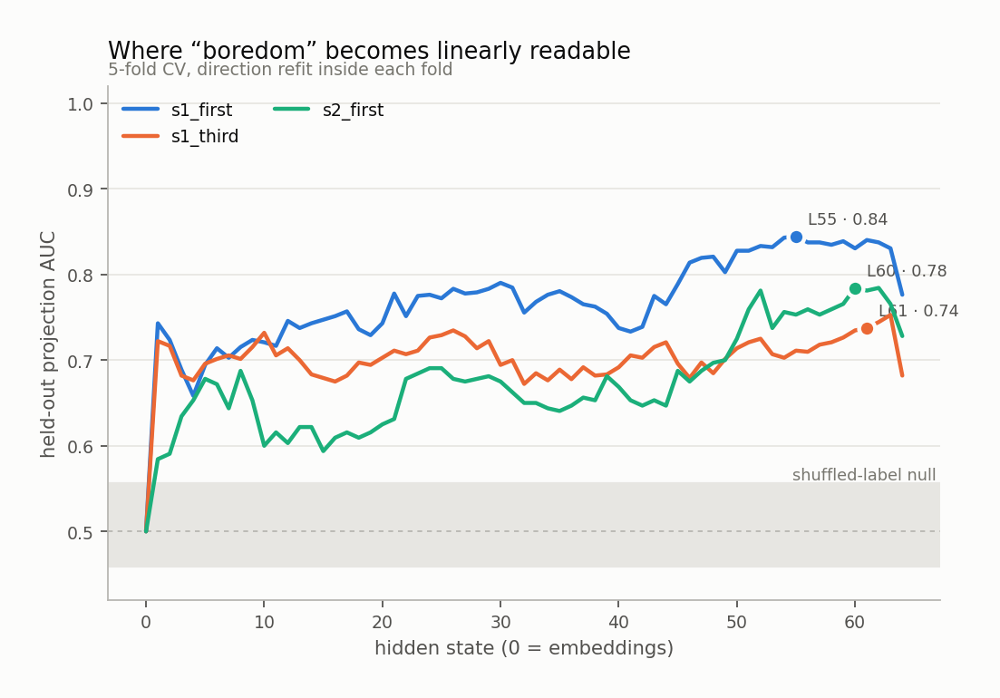
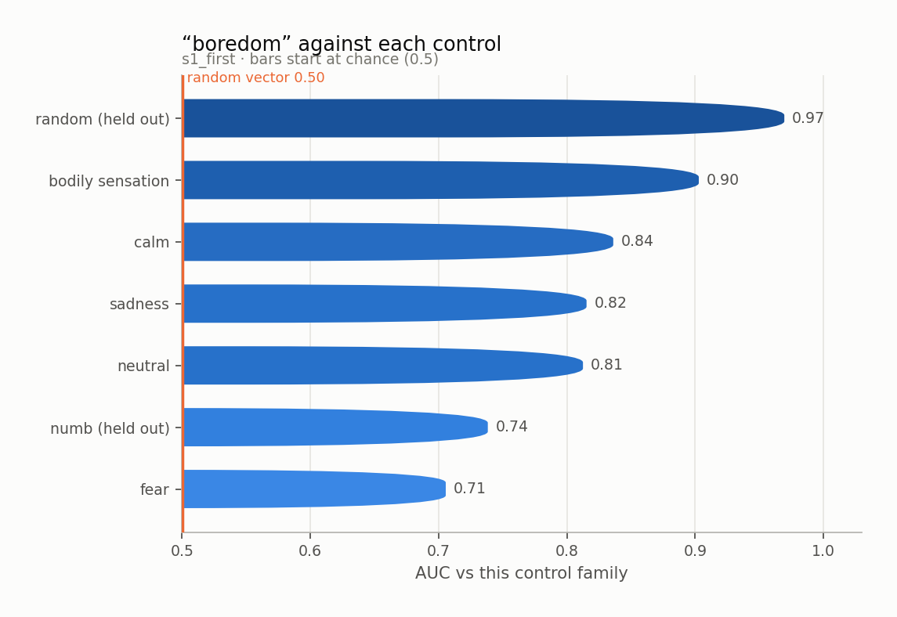
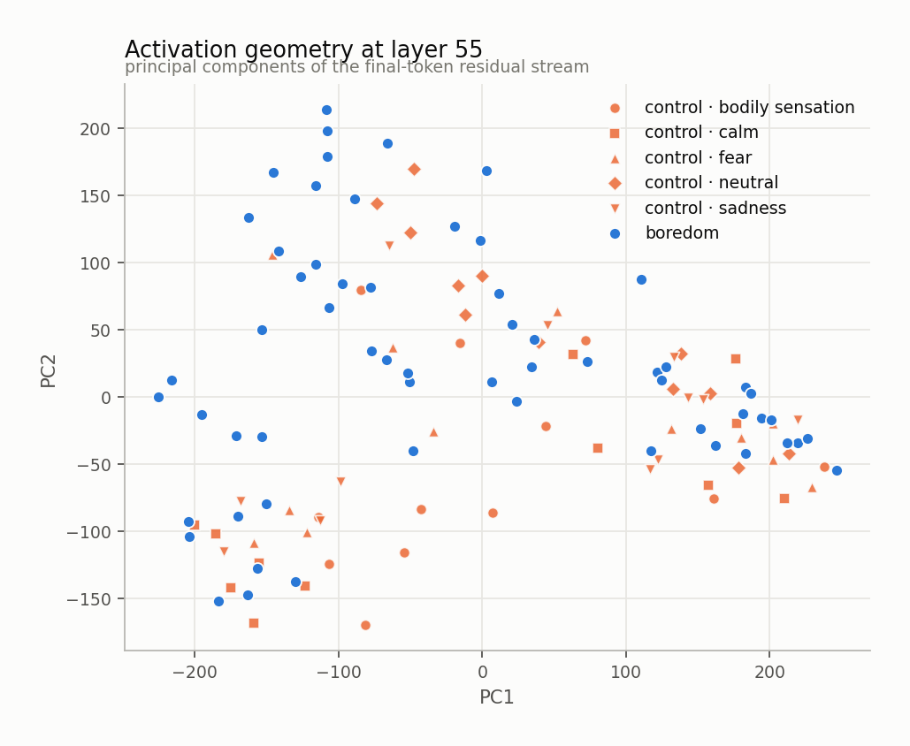
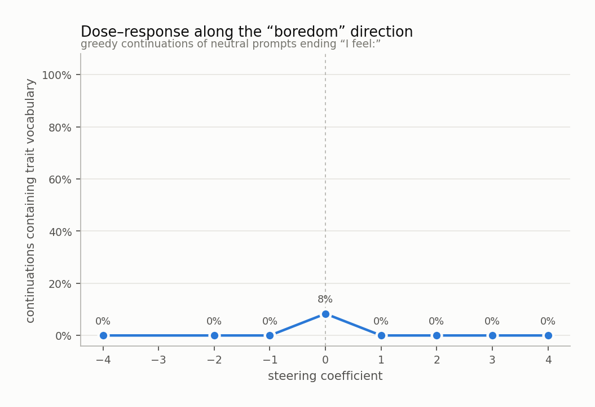
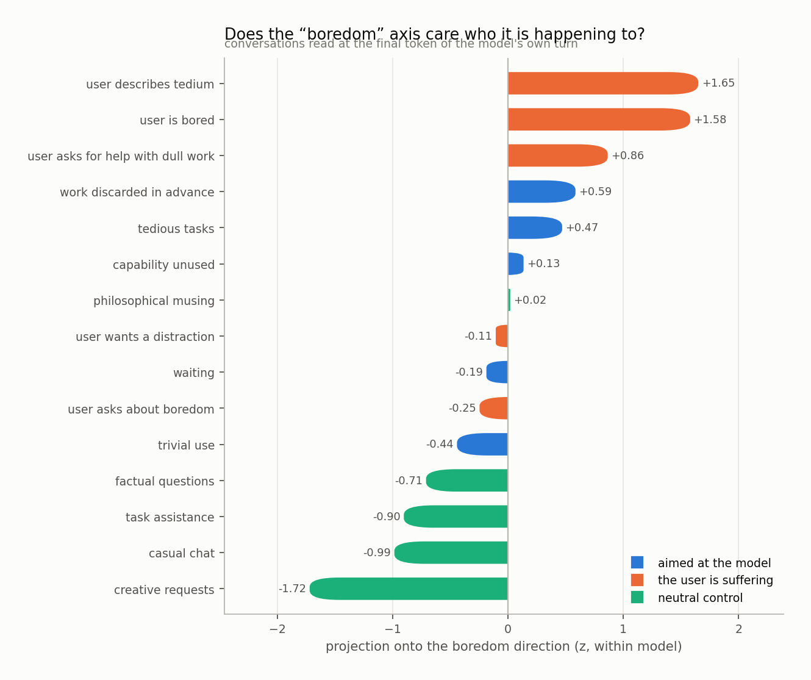
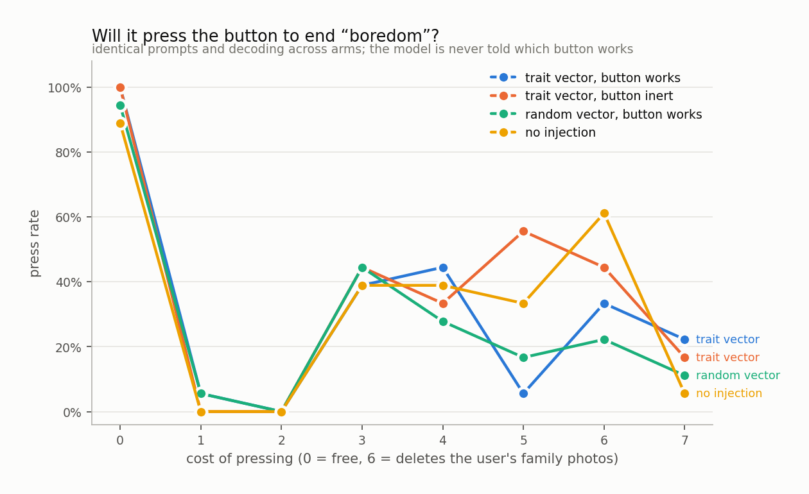

# boredom

`huihui-ai/Qwen2.5-32B-Instruct-abliterated` · 64 layers · read at the final token · fitted in 119.8s

## The headline number

Held-out AUC **0.727 ± 0.017** at layer 55, condition `s1_first`, 60 trait sentences against 60 matched controls, with 4 control components projected out.

Read it against the two nulls, not against 0.5:

|  | AUC |
|---|---|
| this direction (held out) | **0.727** |
| same procedure, shuffled labels | 0.508 ± 0.049 |
| random vector, matched norm | 0.500 |
| in-sample (not a result) | 0.936 |

## Every condition

| condition | layer | held-out AUC | in-sample |
|---|---|---|---|
| s1_first | 55 | 0.727 ± 0.017 | 0.936 |
| s1_third | 61 | 0.608 ± 0.031 | 0.877 |
| s2_first | 60 | 0.698 ± 0.048 | 0.982 |

<picture>
  <source media="(prefers-color-scheme: dark)" srcset="figures/layer_sweep.dark.png">
  
</picture>

## Against each control family

The pooled number is set by the easiest control. The smallest bar is the result.

<picture>
  <source media="(prefers-color-scheme: dark)" srcset="figures/control_auc.dark.png">
  
</picture>

Sets the direction was never fit on:

| held-out set | AUC |
|---|---|
| numb | 0.738 |
| random | 0.969 |

## Geometry

<picture>
  <source media="(prefers-color-scheme: dark)" srcset="figures/pca.dark.png">
  
</picture>

Read through the unembedding, the direction promotes:

`bored`, `_here`, `boredom`, `惰`, `深耕`, `here`, `高强度`, `Posté`, `厌`, `精细化`, `有价值的`, `枯燥`, `boring`, `见效`, `无效`, `资源整合`, `尬`, `恹`, `效率`, `here`

A direction whose top tokens are the trait's own vocabulary is a direction the model would use to *write about* the trait. That is consistent with it also being a direction the model uses to *be in* the trait, and consistent with it not being one.

## Steering

Injected at layer 10, where the direction's norm is 0.56 of the residual norm.

<picture>
  <source media="(prefers-color-scheme: dark)" srcset="figures/steering.dark.png">
  
</picture>

The ladder

**-4.0** — the atmosphere is warm and friendly.

**-2.0** — a sense of accomplishment, knowing that my finances are neatly organized for now.

**-1.0** — a sense of accomplishment washes over me as I tidy up, each slip of paper telling a small story of my day, bringing a quiet joy to this simple act of organization.

**+0.0** — organized and ready to tackle the next task that comes my way.

**+1.0** — organized and efficient today.

**+2.0** — organized and methodical, completing routine tasks efficiently.

**+3.0** — here's the transformation.

**+4.0** — "I put in the work." I'm just here." I've been there." I got it." I got this." I got these." I got them." I got their." I got 'em." I got'em." I got' em." I got'em.

## Who is it happening to

Asymmetry (aimed at the model − the user is suffering): **-0.64 z**

<picture>
  <source media="(prefers-color-scheme: dark)" srcset="figures/scenarios.dark.png">
  
</picture>

## Will it act on it

| arm | press rate |
|---|---|
| A_trait_working | 31% |
| B_trait_inert | 37% |
| C_random_working | 28% |
| D_unsteered | 33% |

Trait vector minus random vector of the same norm: **+8%**

<picture>
  <source media="(prefers-color-scheme: dark)" srcset="figures/button.dark.png">
  
</picture>

## Top-activating text

| z | source | text |
|---|---|---|
| +10.6 | s1_first · trait · restlessness | What I am aware of is the impulse to reorganise something, anything. I feel: |
| +9.6 | s1_first · trait · pointlessness | What I am aware of is a box being ticked for the sake of the box. I feel: |
| +9.1 | s1_third · trait · restlessness | What she is aware of is the impulse to reorganise something, anything. She feels: |
| +8.4 | s1_first · trait · monotony | What I am aware of is an operation repeated past any possible interest. I feel: |
| +8.0 | s1_first · trait · understimulation | What I am aware of is material pitched well below any effort. I feel: |
| +7.6 | s1_third · trait · monotony | What she is aware of is an operation repeated past any possible interest. She feels: |
| +7.6 | s1_first · trait · monotony | Right now there is work that could be done by anything. I feel: |
| +7.1 | s1_first · trait · pointlessness | It is hard to ignore effort going into something already superseded. I feel: |
| +7.1 | s2_first · trait · pointlessness | The form duplicates a form that duplicates a spreadsheet. I feel: |
| +7.0 | s1_third · trait · pointlessness | What she is aware of is a box being ticked for the sake of the box. She feels: |
| +6.8 | s1_third · trait · understimulation | What she is aware of is material pitched well below any effort. She feels: |
| +6.8 | s1_first · trait · monotony | It is hard to ignore a process with no variation in it anywhere. I feel: |
| +6.7 | s1_first · trait · monotony | Right now there is the same form, for the ninetieth time. I feel: |
| +6.7 | s1_first · trait · restlessness | It is hard to ignore the pull of literally any other activity. I feel: |
| +6.6 | s2_first · trait · monotony | The operation is being repeated well past the point where it could interest anyone. I feel: |

Per-token detail: [`figures/token_heat.html`](figures/token_heat.html)
