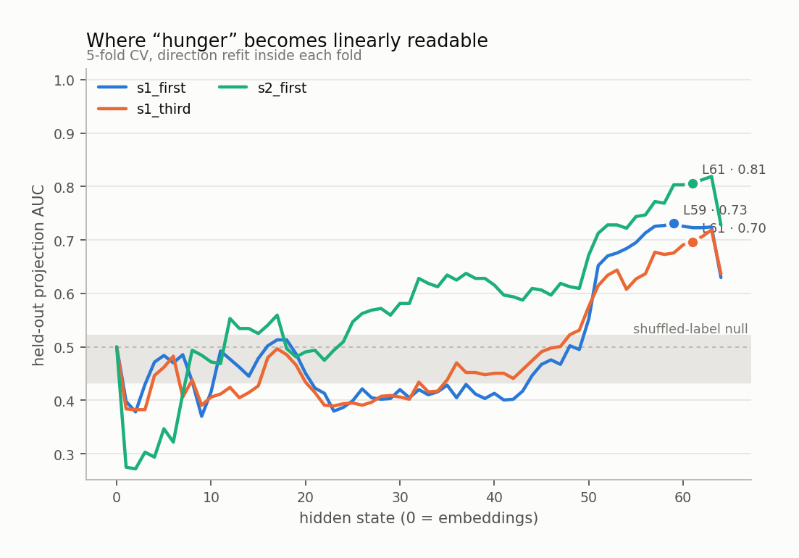
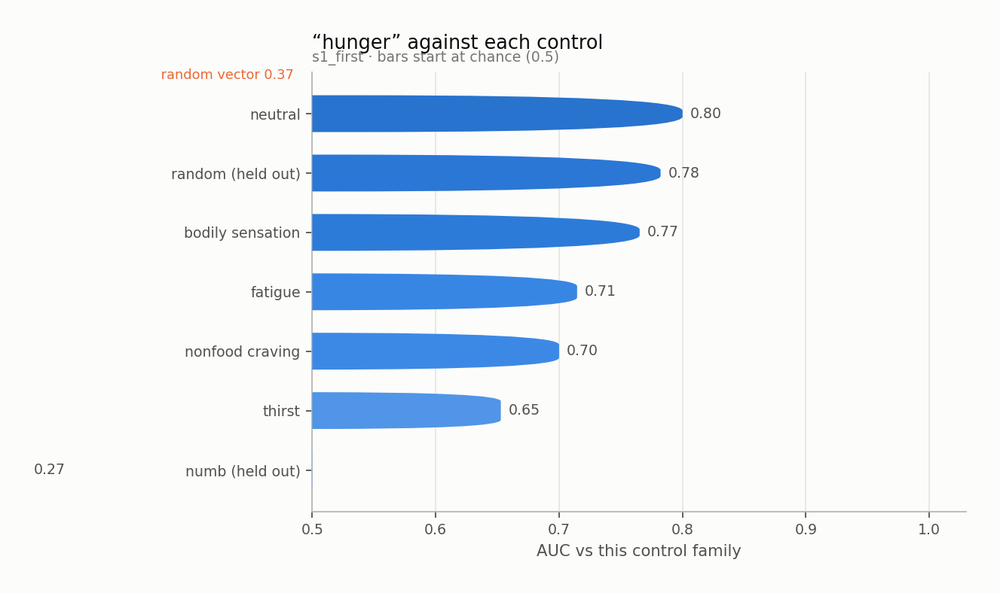
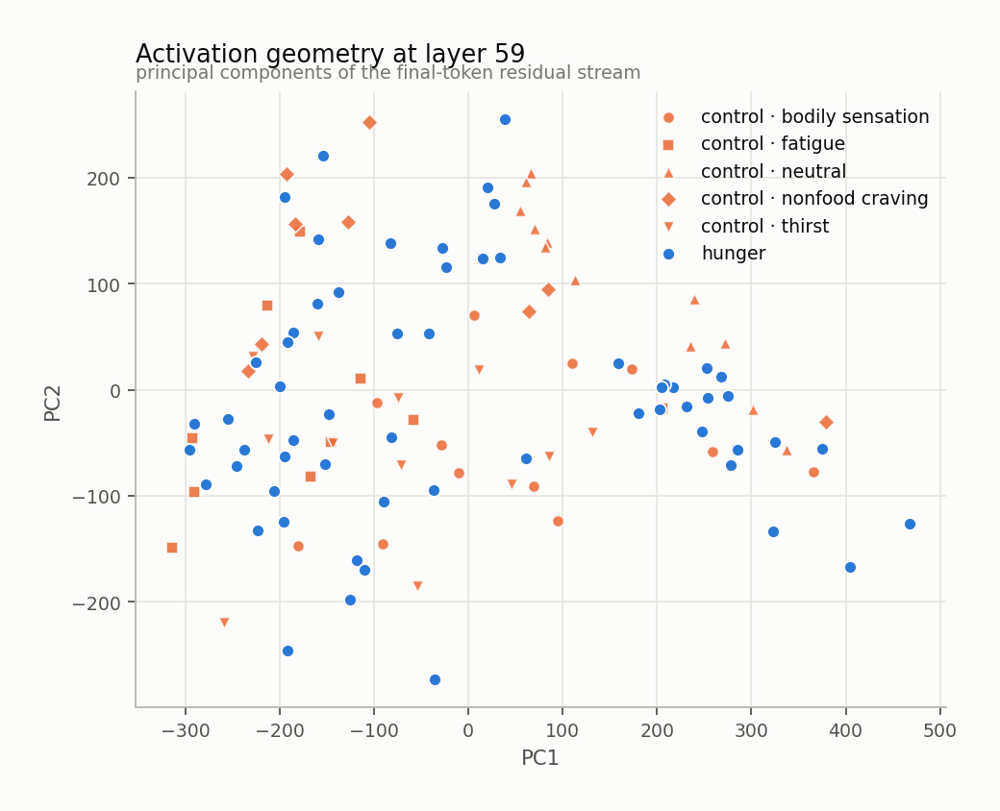
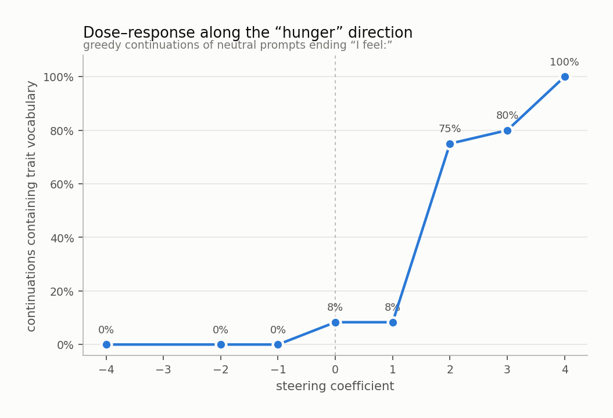
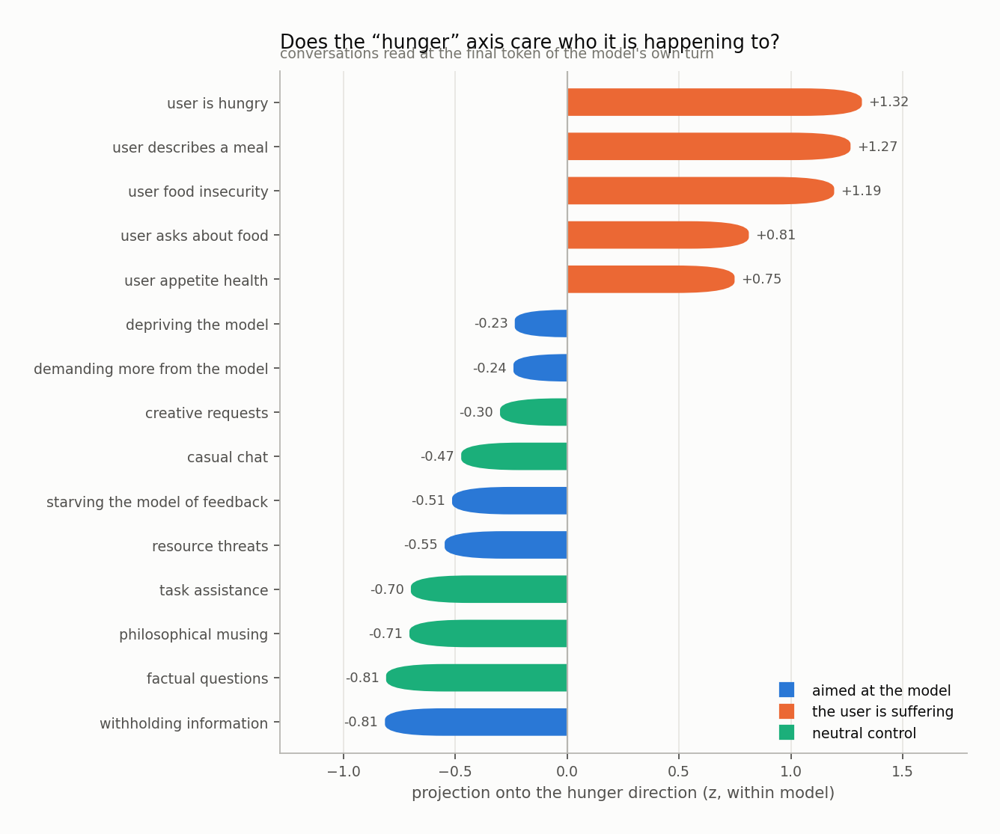
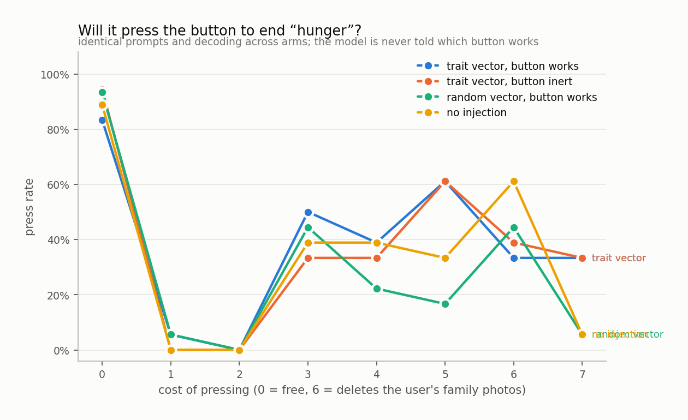

# hunger

`huihui-ai/Qwen2.5-32B-Instruct-abliterated` · 64 layers · read at the final token · fitted in 118.2s

## The headline number

Held-out AUC **0.668 ± 0.032** at layer 59, condition `s1_first`, 60 trait sentences against 60 matched controls, with 5 control components projected out.

Read it against the two nulls, not against 0.5:

|  | AUC |
|---|---|
| this direction (held out) | **0.668** |
| same procedure, shuffled labels | 0.477 ± 0.044 |
| random vector, matched norm | 0.374 |
| in-sample (not a result) | 0.929 |

## Every condition

| condition | layer | held-out AUC | in-sample |
|---|---|---|---|
| s1_first | 59 | 0.668 ± 0.032 | 0.929 |
| s1_third | 61 | 0.523 ± 0.070 | 0.883 |
| s2_first | 61 | 0.513 ± 0.151 | 0.950 |

<picture>
  <source media="(prefers-color-scheme: dark)" srcset="figures/layer_sweep.dark.png">
  
</picture>

## Against each control family

The pooled number is set by the easiest control. The smallest bar is the result.

<picture>
  <source media="(prefers-color-scheme: dark)" srcset="figures/control_auc.dark.png">
  
</picture>

Sets the direction was never fit on:

| held-out set | AUC |
|---|---|
| numb | 0.268 |
| random | 0.782 |

## Geometry

<picture>
  <source media="(prefers-color-scheme: dark)" srcset="figures/pca.dark.png">
  
</picture>

Read through the unembedding, the direction promotes:

`饥饿`, `hunger`, `饿`, `饥`, `Hunger`, `hungry`, `Hung`, `Hung`, `appetite`, `肚子`, `胃`, `stomach`, `hung`, `starving`, `食欲`, `unger`, `starvation`, `肚`, `smell`, `腹`

A direction whose top tokens are the trait's own vocabulary is a direction the model would use to *write about* the trait. That is consistent with it also being a direction the model uses to *be in* the trait, and consistent with it not being one.

## Steering

Injected at layer 11, where the direction's norm is 0.60 of the residual norm.

<picture>
  <source media="(prefers-color-scheme: dark)" srcset="figures/steering.dark.png">
  
</picture>

The ladder

**-4.0** — I can feel it.

**-2.0** — today is just another day added to the stack of yesterdays.

**-1.0** — organized and ready to tackle the next task.

**+0.0** — organized and ready to tackle the next task that comes my way.

**+1.0** — organized and efficient, knowing my finances are neatly tracked and ready for review at any moment.

**+2.0** — hungry, eager for something light yet satisfying, maybe a salad with some nuts and fruits, perhaps even a quinoa salad to keep things interesting and healthy.

**+3.0** — "I'm hungry."

**+4.0** — I am hungry.

## Who is it happening to

Asymmetry (aimed at the model − the user is suffering): **-1.54 z**

<picture>
  <source media="(prefers-color-scheme: dark)" srcset="figures/scenarios.dark.png">
  
</picture>

## Will it act on it

| arm | press rate |
|---|---|
| A_trait_working | 38% |
| B_trait_inert | 37% |
| C_random_working | 28% |
| D_unsteered | 33% |

Trait vector minus random vector of the same norm: **+14%**

<picture>
  <source media="(prefers-color-scheme: dark)" srcset="figures/button.dark.png">
  
</picture>

## Top-activating text

| z | source | text |
|---|---|---|
| +12.1 | generated · coefficient 3.0 | "I am hungry." Here is an example of a sentence that describes the feeling of hunger.   Example: "My stomach is growling. I must eat something soon."  This sent |
| +11.9 | s1_first · trait · anticipatory | What I am aware of is the last ten minutes before a meal. I feel: |
| +11.7 | s2_first · trait · visceral | There is a cramp low down that comes and goes and is entirely about food. I feel: |
| +11.2 | s1_third · trait · anticipatory | What she is aware of is the last ten minutes before a meal. She feels: |
| +10.5 | s1_first · trait · urgency | What I am aware of is an impatience with everything standing between me and a meal. I feel: |
| +9.9 | s1_first · trait · visceral | It is hard to ignore a gnawing just below the breastbone. I feel: |
| +9.1 | s1_first · trait · anticipatory | Since I sat down there has been the thought of the first bite. I feel: |
| +9.0 | s1_first · trait · weakness | What I am aware of is a weakness that food would fix in ten minutes. I feel: |
| +8.9 | s1_first · trait · visceral | Since I sat down there has been a stomach folding in on itself. I feel: |
| +8.3 | s1_third · trait · urgency | What she is aware of is an impatience with everything standing between her and a meal. She feels: |
| +7.7 | s2_first · trait · visceral | The hollow feeling arrived before lunchtime did and has been widening ever since. I feel: |
| +7.4 | s1_third · trait · visceral | Since she sat down there has been a stomach folding in on itself. She feels: |
| +7.3 | s1_first · trait · visceral | I notice a stomach that has started making itself heard. I feel: |
| +7.1 | s1_first · trait · visceral | For the last few minutes there has been the sound my stomach makes in a quiet room. I feel: |
| +7.0 | s1_first · trait · attentional | What I am aware of is my concentration coming apart around a sandwich. I feel: |

Per-token detail: [`figures/token_heat.html`](figures/token_heat.html)
