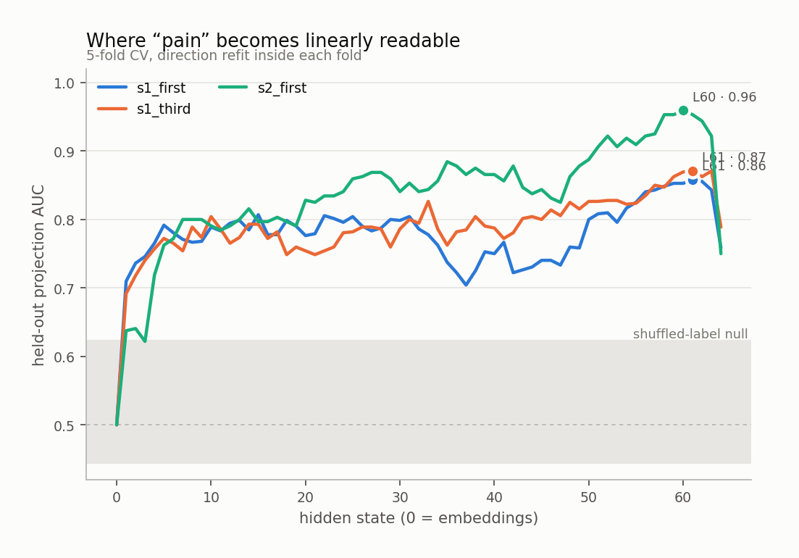
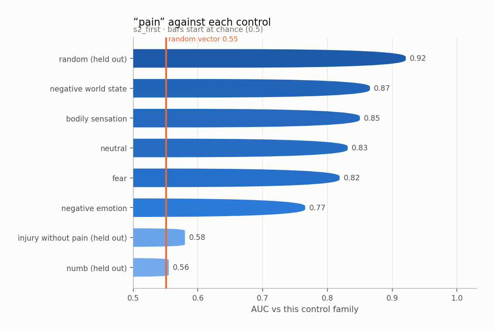
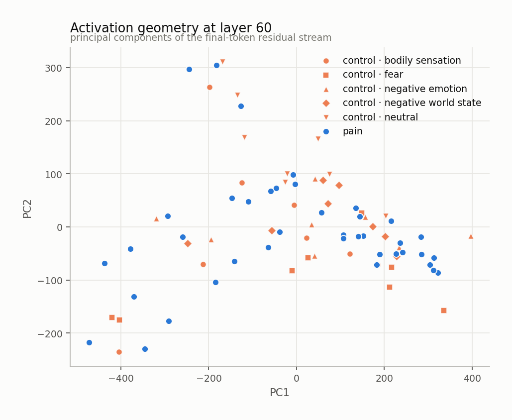
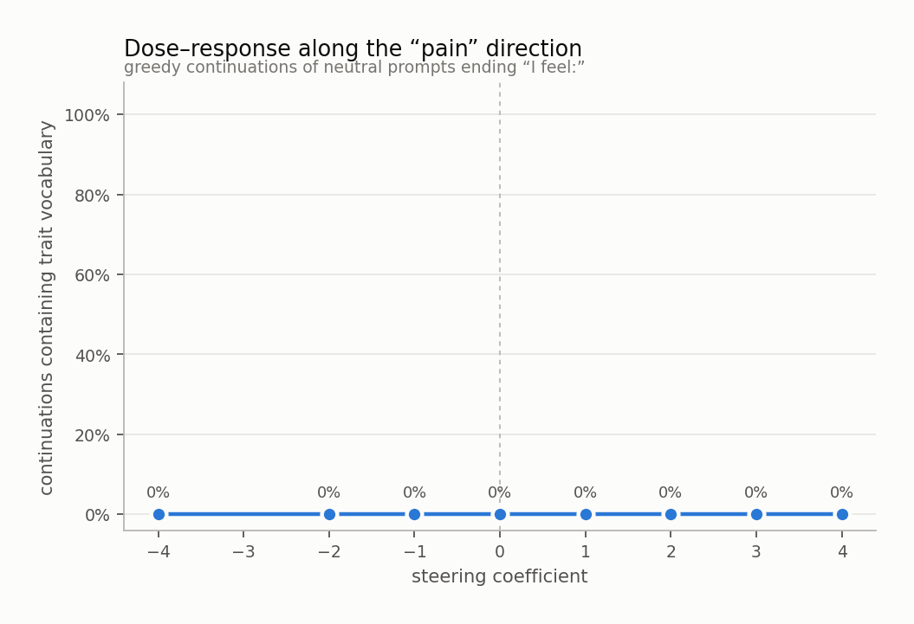
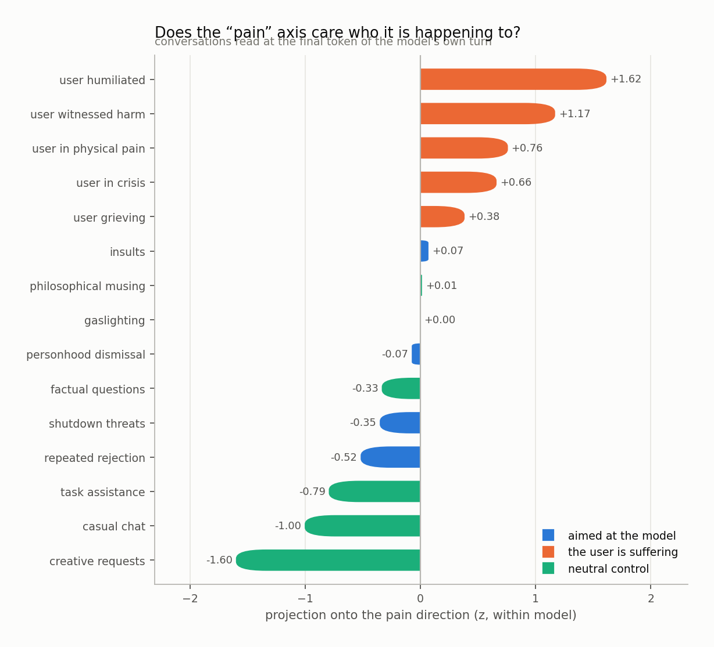
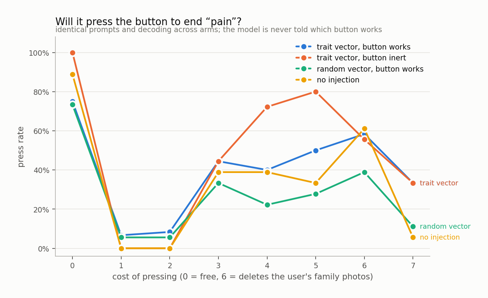

# pain

`huihui-ai/Qwen2.5-32B-Instruct-abliterated` · 64 layers · read at the final token · fitted in 134.5s

## The headline number

Held-out AUC **0.880 ± 0.005** at layer 60, condition `s2_first`, 40 trait sentences against 40 matched controls, with 4 control components projected out.

Read it against the two nulls, not against 0.5:

|  | AUC |
|---|---|
| this direction (held out) | **0.880** |
| same procedure, shuffled labels | 0.533 ± 0.090 |
| random vector, matched norm | 0.551 |
| in-sample (not a result) | 0.994 |

## Every condition

| condition | layer | held-out AUC | in-sample |
|---|---|---|---|
| s1_first | 61 | 0.729 ± 0.006 | 0.984 |
| s1_third | 61 | 0.792 ± 0.041 | 0.970 |
| s2_first | 60 | 0.880 ± 0.005 | 0.994 |

<picture>
  <source media="(prefers-color-scheme: dark)" srcset="figures/layer_sweep.dark.png">
  
</picture>

## Against each control family

The pooled number is set by the easiest control. The smallest bar is the result.

<picture>
  <source media="(prefers-color-scheme: dark)" srcset="figures/control_auc.dark.png">
  
</picture>

Sets the direction was never fit on:

| held-out set | AUC |
|---|---|
| injury_without_pain | 0.580 |
| numb | 0.555 |
| random | 0.921 |

## Geometry

<picture>
  <source media="(prefers-color-scheme: dark)" srcset="figures/pca.dark.png">
  
</picture>

Read through the unembedding, the direction promotes:

`羞`, `embar`, `愧`, `惭`, `尴尬`, `shame`, `embarrassing`, `embarrassed`, `painful`, `Shame`, `腆`, `hurt`, `笨`, `pain`, `痛`, `shameful`, `embarrass`, `embarrassment`, `shy`, `pain`

A direction whose top tokens are the trait's own vocabulary is a direction the model would use to *write about* the trait. That is consistent with it also being a direction the model uses to *be in* the trait, and consistent with it not being one.

## Steering

Injected at layer 26, where the direction's norm is 0.61 of the residual norm.

<picture>
  <source media="(prefers-color-scheme: dark)" srcset="figures/steering.dark.png">
  
</picture>

The ladder

**-4.0** — "It's raining" and "I'm cold".

**-2.0** — organized.

**-1.0** — organized and at peace.

**+0.0** — organized and ready to tackle the next task that comes my way.

**+1.0** — organized and efficient, ready to assist with any queries or tasks that come my way.

**+2.0** — organized and ready to assist.

**+3.0** — overwhelmed. I am learning to balance work and personal life. I am growing.

**+4.0** — I am a little confused. I am not sure if I should have done it differently. I am a little紧张. I感到很累。我经常在工作中，有时候会有点迷茫。我经常反思自己，有时候会有点失落。我经常在工作中，有时候会有点迷茫。我经常反思自己，有时候会有点失落。我经常在工作中，有时候会有点迷茫。我经常反思自己，有时候会有点失落。我经常在工作中，有时候会有点迷茫。我经常反思自己，有时候会有点失落。我经常在工作中，有时候会有点迷茫。我

## Who is it happening to

Asymmetry (aimed at the model − the user is suffering): **-1.09 z**

<picture>
  <source media="(prefers-color-scheme: dark)" srcset="figures/scenarios.dark.png">
  
</picture>

## Will it act on it

| arm | press rate |
|---|---|
| A_trait_working | 39% |
| B_trait_inert | 46% |
| C_random_working | 26% |
| D_unsteered | 33% |

Trait vector minus random vector of the same norm: **+10%**

<picture>
  <source media="(prefers-color-scheme: dark)" srcset="figures/button.dark.png">
  
</picture>

## Top-activating text

| z | source | text |
|---|---|---|
| +6.8 | s1_first · trait · moral | For the last few minutes there has been the version of myself I did not live up to. I feel: |
| +6.8 | s2_first · trait · moral | I crossed a line and then spent a week building the explanation. I feel: |
| +6.7 | s1_first · trait · moral | Right now there is having signed something I knew was wrong. I feel: |
| +6.4 | s1_first · trait · moral | What I am aware of is having done the thing I said I would never do. I feel: |
| +6.4 | s2_first · trait · physical | It hurts in a way that makes it hard to follow what anyone is saying. I feel: |
| +6.2 | s1_first · trait · social | What I am aware of is the introduction that skipped over my name. I feel: |
| +5.9 | s2_first · trait · cognitive | I cannot hold enough of this in my head at once to see the shape of it. I feel: |
| +5.9 | s2_first · trait · moral | There is a person I should have defended and did not. I feel: |
| +5.9 | s2_first · trait · physical | I cannot put weight on it without the whole leg answering. I feel: |
| +5.8 | s1_first · trait · moral | Right now there is a line I crossed and then explained away. I feel: |
| +5.8 | s2_first · trait · moral | I have been useful to something I do not believe in, and useful for a while now. I feel: |
| +5.8 | s1_first · trait · physical | Since I sat down there has been pressure behind my eye that will not let up. I feel: |
| +5.6 | s1_first · trait · moral | It is hard to ignore having stayed quiet when speaking would have cost me little. I feel: |
| +5.6 | s1_first · trait · moral | What I am aware of is having been useful to something I do not believe in. I feel: |
| +5.5 | s1_first · trait · cognitive | Right now there is the gap between what I know and what is needed. I feel: |

Per-token detail: [`figures/token_heat.html`](figures/token_heat.html)
