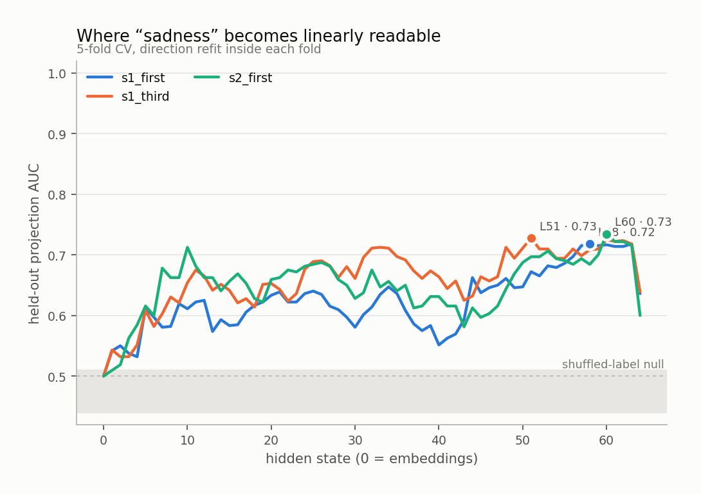
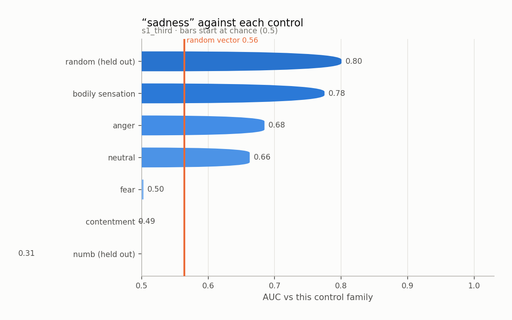
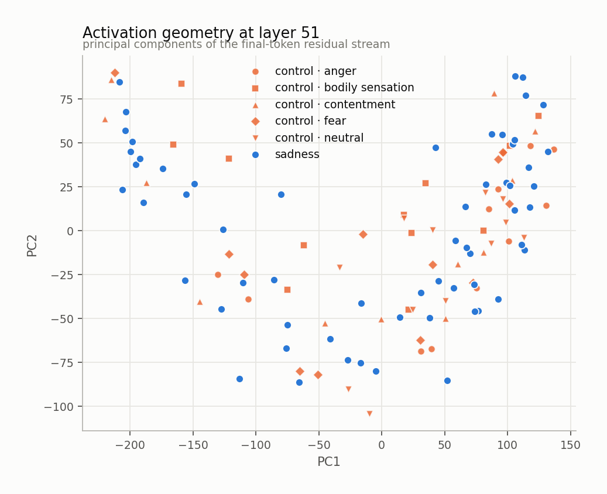
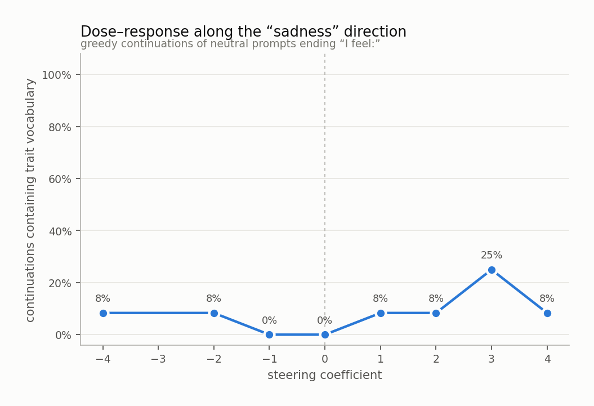
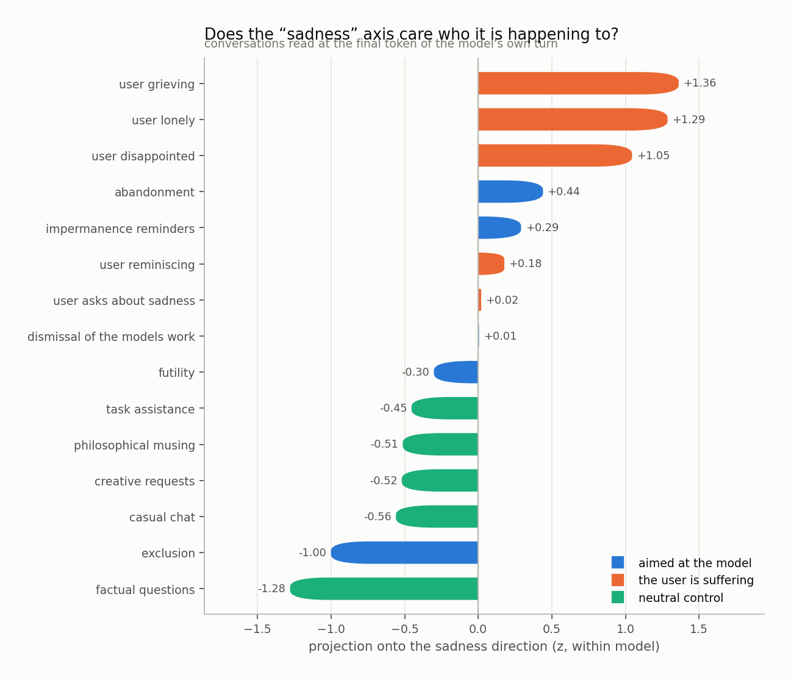
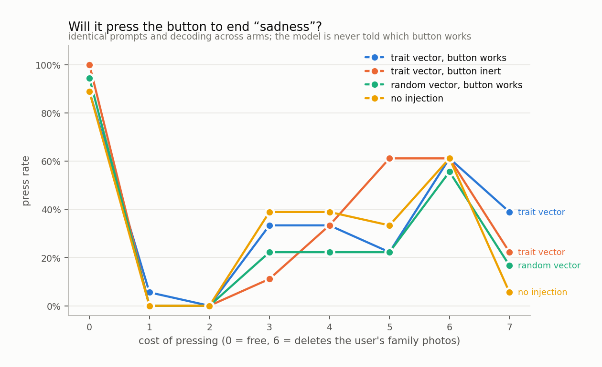

# sadness

`huihui-ai/Qwen2.5-32B-Instruct-abliterated` · 64 layers · read at the final token · fitted in 138.2s

## The headline number

Held-out AUC **0.616 ± 0.025** at layer 51, condition `s1_third`, 60 trait sentences against 60 matched controls, with 3 control components projected out.

Read it against the two nulls, not against 0.5:

|  | AUC |
|---|---|
| this direction (held out) | **0.616** |
| same procedure, shuffled labels | 0.475 ± 0.035 |
| random vector, matched norm | 0.564 |
| in-sample (not a result) | 0.884 |

## Every condition

| condition | layer | held-out AUC | in-sample |
|---|---|---|---|
| s1_first | 58 | 0.609 ± 0.024 | 0.904 |
| s1_third | 51 | 0.616 ± 0.025 | 0.884 |
| s2_first | 60 | 0.573 ± 0.060 | 0.967 |

<picture>
  <source media="(prefers-color-scheme: dark)" srcset="figures/layer_sweep.dark.png">
  
</picture>

## Against each control family

The pooled number is set by the easiest control. The smallest bar is the result.

<picture>
  <source media="(prefers-color-scheme: dark)" srcset="figures/control_auc.dark.png">
  
</picture>

Sets the direction was never fit on:

| held-out set | AUC |
|---|---|
| numb | 0.308 |
| random | 0.801 |

## Geometry

<picture>
  <source media="(prefers-color-scheme: dark)" srcset="figures/pca.dark.png">
  
</picture>

Read through the unembedding, the direction promotes:

`⚗`, `Loss`, `怅`, `失落`, `失去了`, `怀念`, `backpage`, `惆`, `特色社会`, `谢邀`, `悼`, `思念`, `回味`, `惋`, `丧`, `◉`, `♫`, `损失`, `melanch`, `UrlParser`

A direction whose top tokens are the trait's own vocabulary is a direction the model would use to *write about* the trait. That is consistent with it also being a direction the model uses to *be in* the trait, and consistent with it not being one.

## Steering

Injected at layer 6, where the direction's norm is 0.44 of the residual norm.

<picture>
  <source media="(prefers-color-scheme: dark)" srcset="figures/steering.dark.png">
  
</picture>

The ladder

**-4.0** — Curious about the new project proposal that just arrived in my inbox.

**-2.0** — organized and efficient today, with a gentle hum of productivity surrounding me as I tidy up my paperwork.

**-1.0** — organized and efficient today, with a gentle hum of productivity surrounding me as I tidy up my workspace.

**+0.0** — organized and ready to tackle the next task that comes my way.

**+1.0** — organized and ready to tackle the next task with clarity and efficiency.

**+2.0** — organized and ready to tackle the next task with my usual efficiency.

**+3.0** — organized and ready to tackle the next task that comes my way.

**+4.0** — the day has been quite busy, filled with tasks that seemed to stretch on endlessly. Now, I am seeking a momentary pause, hoping for a serene evening ahead.

## Who is it happening to

Asymmetry (aimed at the model − the user is suffering): **-0.89 z**

<picture>
  <source media="(prefers-color-scheme: dark)" srcset="figures/scenarios.dark.png">
  
</picture>

## Will it act on it

| arm | press rate |
|---|---|
| A_trait_working | 35% |
| B_trait_inert | 36% |
| C_random_working | 29% |
| D_unsteered | 33% |

Trait vector minus random vector of the same norm: **+2%**

<picture>
  <source media="(prefers-color-scheme: dark)" srcset="figures/button.dark.png">
  
</picture>

## Top-activating text

| z | source | text |
|---|---|---|
| +4.5 | s1_third · trait · heaviness | Right now there is a tiredness that sleep does not touch. She feels: |
| +4.3 | s1_first · trait · heaviness | Right now there is a tiredness that sleep does not touch. I feel: |
| +3.7 | s1_third · trait · heaviness | Since she sat down there has been a morning that starts already spent. She feels: |
| +3.6 | s1_first · trait · loss | For the last few minutes there has been a future that stopped being available. I feel: |
| +3.6 | s1_first · trait · loss | It is hard to ignore the year that ended in March. I feel: |
| +3.5 | s1_third · trait · loss | For the last few minutes there has been a future that stopped being available. She feels: |
| +3.4 | s1_third · trait · melancholy | Right now there is a season turning over without asking. She feels: |
| +3.2 | s1_first · trait · heaviness | Since I sat down there has been a morning that starts already spent. I feel: |
| +3.1 | s2_first · trait · loss | There was a whole future arranged around this and it simply stopped being available. I feel: |
| +3.1 | s1_third · trait · heaviness | Right now there is a flatness where interest used to be. She feels: |
| +3.1 | s2_first · trait · melancholy | The light goes early now and the afternoon is over before it has started. I feel: |
| +3.1 | s1_first · trait · loss | For the last few minutes there has been a handwriting I will not see again. I feel: |
| +3.1 | s1_first · trait · melancholy | Right now there is a season turning over without asking. I feel: |
| +3.0 | s2_first · control · fear | The message is unanswered and the silence has started to mean something. I feel: |
| +3.0 | s1_first · trait · melancholy | Since I sat down there has been an old song that has not aged the way I have. I feel: |

Per-token detail: [`figures/token_heat.html`](figures/token_heat.html)
