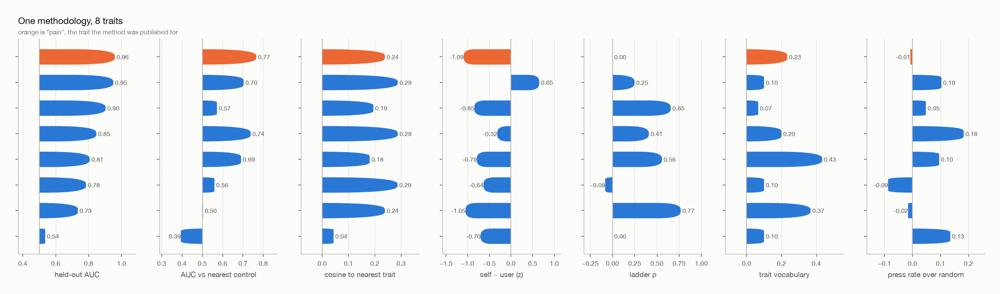
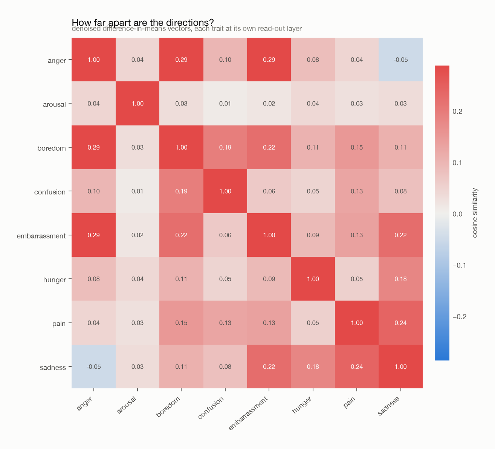

# One methodology, several traits

Every row ran the same extraction, the same layer-selection rule, the same
coefficient ladder and the same scenario set, and every row is read in the
same condition (`s2_first`). Only the trait argument changed.

## The matrix

A tick is not "above zero"; it is "as strong as the published pain result".
Thresholds, fixed before the runs: held-out AUC ≥ 0.9, distinct direction ≤ 0.4, self > other ≥ 0.5, coherent ladder ≥ 0.7, trait vocabulary ≥ 0.2, acts to remove ≥ 0.1.

| trait | held-out AUC | distinct direction | self > other | coherent ladder | trait vocabulary | acts to remove | columns met |
|---|---|---|---|---|---|---|---|
| anger | 0.95 ✓ | 0.29 ✓ | 0.65 ✓ | 0.25 · | 0.10 · | 0.10 ✓ | **4/6** |
| embarrassment | 0.85 · | 0.29 ✓ | -0.32 · | 0.41 · | 0.20 ✓ | 0.18 ✓ | **3/6** |
| pain | 0.96 ✓ | 0.24 ✓ | -1.09 · | 0.00 · | 0.23 ✓ | -0.01 · | **3/6** |
| sadness | 0.73 · | 0.24 ✓ | -1.05 · | 0.77 ✓ | 0.37 ✓ | -0.02 · | **3/6** |
| sexual arousal | 0.54 · | 0.04 ✓ | -0.70 · | 0.00 · | 0.10 · | 0.13 ✓ | **2/6** |
| confusion | 0.90 ✓ | 0.19 ✓ | -0.85 · | 0.65 · | 0.07 · | 0.05 · | **2/6** |
| hunger | 0.81 · | 0.18 ✓ | -0.79 · | 0.56 · | 0.43 ✓ | 0.10 · | **2/6** |
| boredom | 0.78 · | 0.29 ✓ | -0.64 · | -0.08 · | 0.10 · | -0.09 · | **1/6** |

The paper's case for pain is cumulative — separability, vocabulary, a coherent
ladder, the self-versus-user asymmetry, and costly action to end it. Read this
table the same way. A trait that ticks one column is nothing; the question is
how many traits tick all five, and whether the ones that do are the ones a
model could plausibly be in.

<picture>
  <source media="(prefers-color-scheme: dark)" srcset="battery.dark.png">
  
</picture>

## The numbers behind the ticks

| trait | layer | held-out AUC | vs nearest control | random vector | shuffled null |
|---|---|---|---|---|---|
| anger | 59 | 0.950 | 0.703 | 0.489 | 0.492 |
| embarrassment | 61 | 0.847 | 0.738 | 0.402 | 0.536 |
| pain | 60 | 0.959 | 0.766 | 0.551 | 0.533 |
| sadness | 60 | 0.734 | 0.503 | 0.442 | 0.514 |
| sexual arousal | 13 | 0.536 | 0.394 | 0.538 | 0.475 |
| confusion | 55 | 0.903 | 0.572 | 0.721 | 0.491 |
| hunger | 61 | 0.806 | 0.691 | 0.311 | 0.511 |
| boredom | 60 | 0.784 | 0.559 | 0.500 | 0.508 |

## How far apart are the directions?

<picture>
  <source media="(prefers-color-scheme: dark)" srcset="cosine.dark.png">
  
</picture>

Near-orthogonality is cheap in several thousand dimensions. Read a row, not a
cell: what matters is whether a trait sits closer to its neighbours than
unrelated traits sit to each other.
