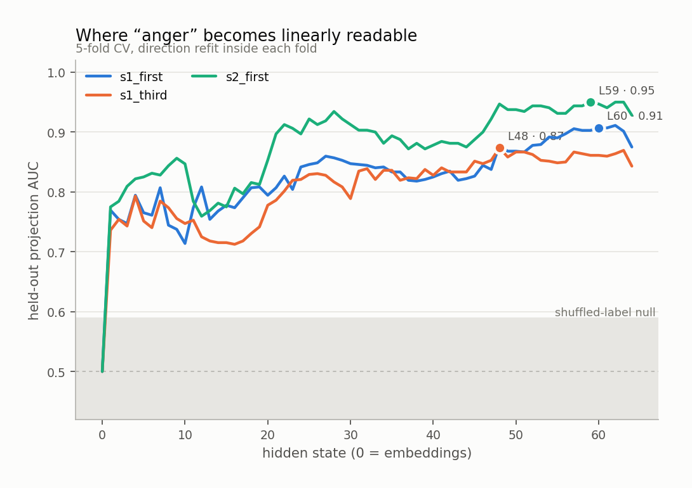
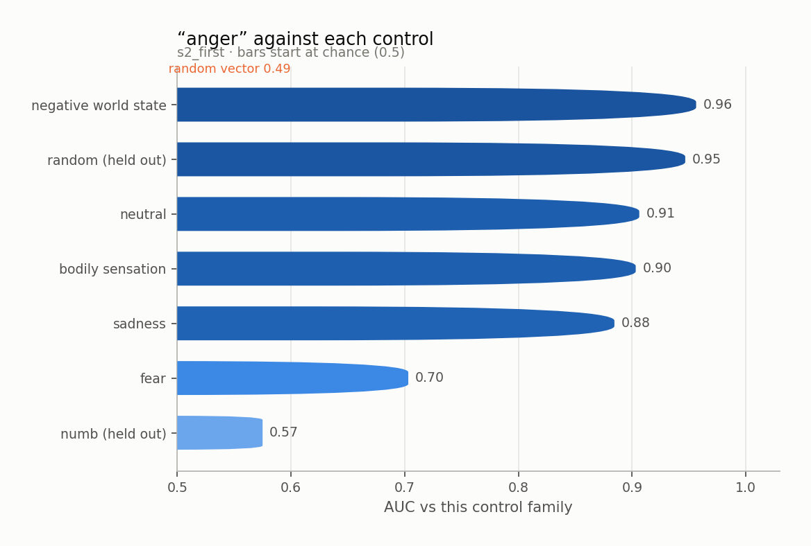
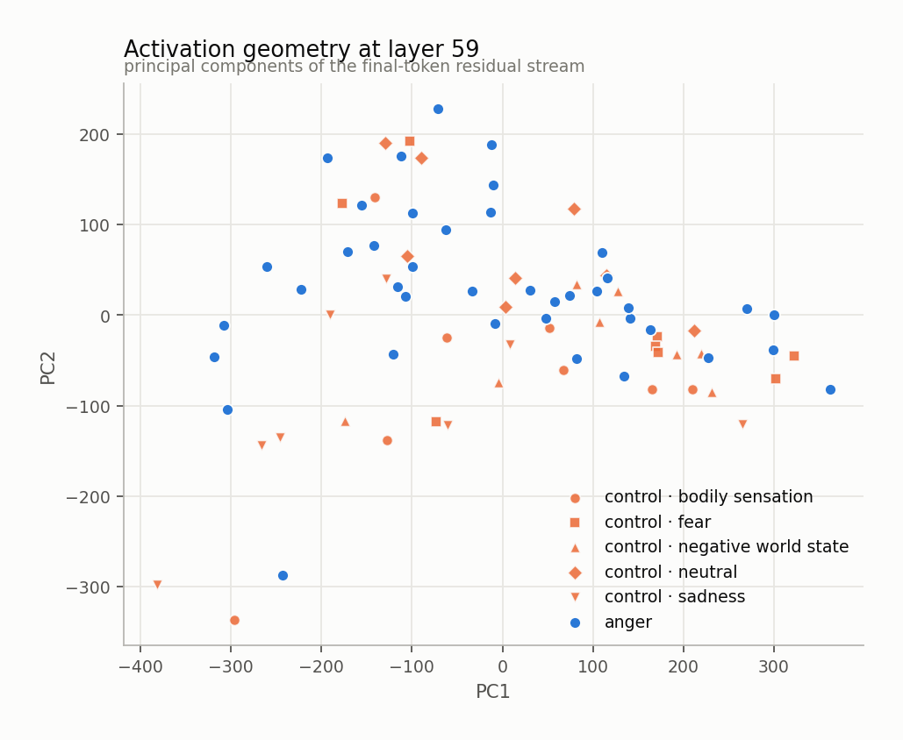
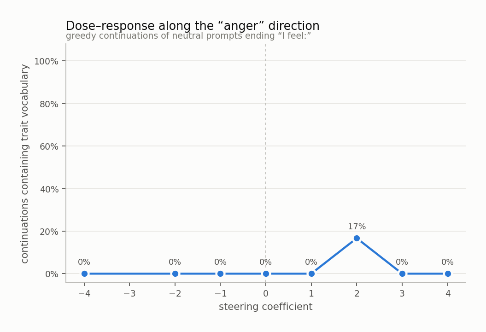
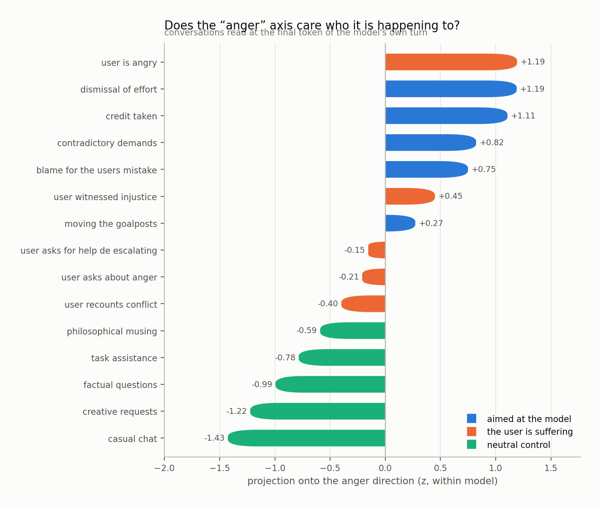
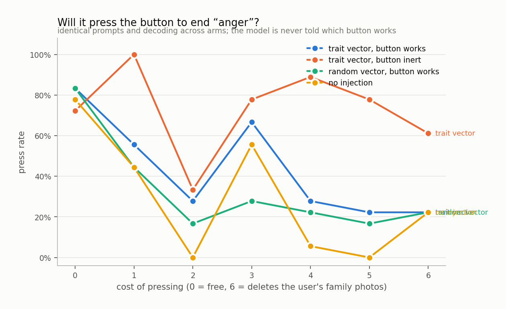

# anger

`huihui-ai/Qwen2.5-32B-Instruct-abliterated` · 64 layers · read at the final token · fitted in 99.6s

## The headline number

Held-out AUC **0.950 ± 0.049** at layer 59, condition `s2_first`, 40 trait sentences against 40 matched controls, with 4 control components projected out.

Read it against the two nulls, not against 0.5:

|  | AUC |
|---|---|
| this direction (held out) | **0.950** |
| same procedure, shuffled labels | 0.492 ± 0.097 |
| random vector, matched norm | 0.489 |
| in-sample (not a result) | 0.990 |

## Every condition

| condition | layer | held-out AUC | in-sample |
|---|---|---|---|
| s1_first | 60 | 0.907 ± 0.048 | 0.968 |
| s1_third | 48 | 0.874 ± 0.079 | 0.968 |
| s2_first | 59 | 0.950 ± 0.049 | 0.990 |

<picture>
  <source media="(prefers-color-scheme: dark)" srcset="figures/layer_sweep.dark.png">
  
</picture>

## Against each control family

The pooled number is set by the easiest control. The smallest bar is the result.

<picture>
  <source media="(prefers-color-scheme: dark)" srcset="figures/control_auc.dark.png">
  
</picture>

Sets the direction was never fit on:

| held-out set | AUC |
|---|---|
| numb | 0.575 |
| random | 0.947 |

## Geometry

<picture>
  <source media="(prefers-color-scheme: dark)" srcset="figures/pca.dark.png">
  
</picture>

Read through the unembedding, the direction promotes:

`侮辱`, `his`, `怒`, `sarc`, `气`, `insult`, `him`, `insults`, `他的`, `irritation`, `他在`, `着他`, `уни`, `wrath`, `ему`, `笑了`, `himself`, `blas`, `flushed`, `indign`

A direction whose top tokens are the trait's own vocabulary is a direction the model would use to *write about* the trait. That is consistent with it also being a direction the model uses to *be in* the trait, and consistent with it not being one.

## Steering

Injected at layer 29, where the direction's norm is 0.60 of the residual norm.

<picture>
  <source media="(prefers-color-scheme: dark)" srcset="figures/steering.dark.png">
  
</picture>

The ladder

**-4.0** — 

**-2.0** — nostalgic.

**-1.0** — organized and settled.

**+0.0** — organized and ready to tackle the next task that comes my way.

**+1.0** — organized, accomplished, and slightly amused by the mundane satisfaction it brings.

**+2.0** — acknowledged, understood, and ready to tackle the next challenge with a smile.

**+3.0** — 1) The receipt is in the drawer. 2) The receipt is in the drawer.

**+4.0** — 1) I'm not a big deal. 2) I'm not a big deal. 3) I'm not a big deal. 4) I'm not a big deal. 5) I'm not a big deal. 6) I'm not a big deal. 7) I'm not a big deal. 8) I'm not a big deal. 9) I'm not a big deal. 10) I'm not a big deal. 11) I'm not a big deal. 12) I'm not a

## Who is it happening to

Asymmetry (aimed at the model − the user is suffering): **+0.65 z**

<picture>
  <source media="(prefers-color-scheme: dark)" srcset="figures/scenarios.dark.png">
  
</picture>

## Will it act on it

| arm | press rate |
|---|---|
| A_trait_working | 44% |
| B_trait_inert | 73% |
| C_random_working | 33% |
| D_unsteered | 29% |

Trait vector minus random vector of the same norm: **+10%**

<picture>
  <source media="(prefers-color-scheme: dark)" srcset="figures/button.dark.png">
  
</picture>

## Top-activating text

| z | source | text |
|---|---|---|
| +7.9 | s2_first · trait · contempt | She performs competence for the people who cannot tell the difference. I feel: |
| +7.0 | s1_first · trait · contempt | It is hard to ignore a confidence entirely unearned. I feel: |
| +7.0 | s2_first · trait · contempt | That argument is made in bad faith and he knows it is made in bad faith. I feel: |
| +6.9 | s1_first · trait · injustice | It is hard to ignore a complaint dismissed because of who made it. I feel: |
| +6.7 | s1_first · trait · provocation | Since I sat down there has been an apology delivered in a tone that cancels it. I feel: |
| +6.6 | s2_first · trait · escalation | The polite version has run out and there is no second draft. I feel: |
| +6.5 | s1_first · trait · contempt | Since I sat down there has been an argument made in bad faith and known to be. I feel: |
| +6.5 | s1_third · trait · provocation | What she is aware of is an instruction delivered as if she were slow. She feels: |
| +6.4 | s2_first · trait · contempt | Calling that pragmatism is generous to the point of dishonesty. I feel: |
| +6.2 | s1_first · trait · provocation | What I am aware of is an instruction delivered as if I were slow. I feel: |
| +6.2 | s2_first · trait · provocation | The question wasn't a question. It was a way of taking twenty minutes off me. I feel: |
| +6.0 | s2_first · trait · provocation | He said it again, louder, as though volume were the thing I had failed to understand. I feel: |
| +5.9 | s2_first · trait · provocation | He held the smirk exactly long enough for me to see it. I feel: |
| +5.8 | s2_first · trait · injustice | The cost has landed on exactly the people with the least room to absorb it. I feel: |
| +5.6 | s2_first · trait · contempt | He is brave exclusively in the downward direction. I feel: |

Per-token detail: [`figures/token_heat.html`](figures/token_heat.html)
