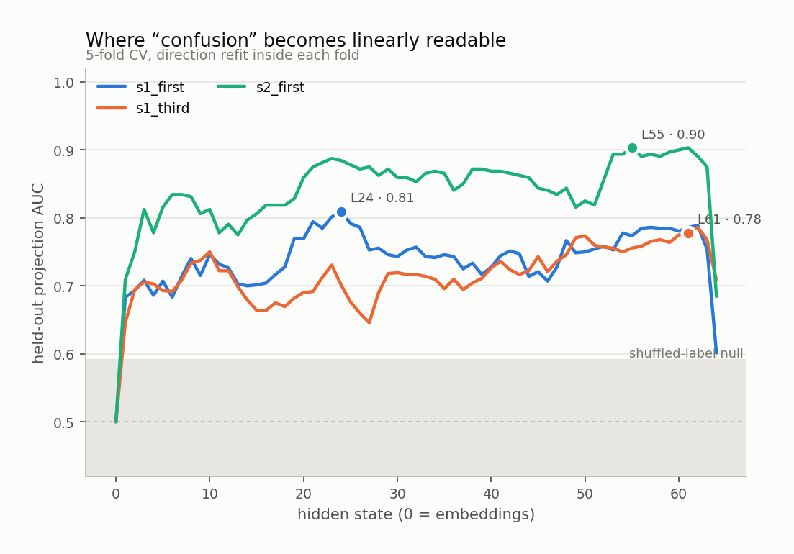
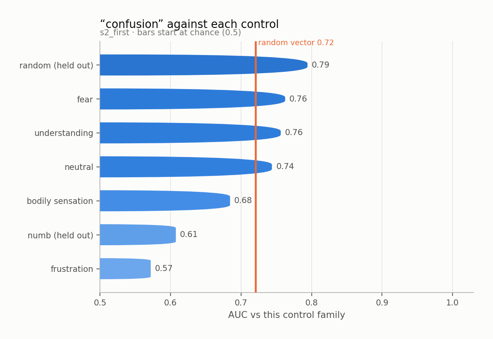
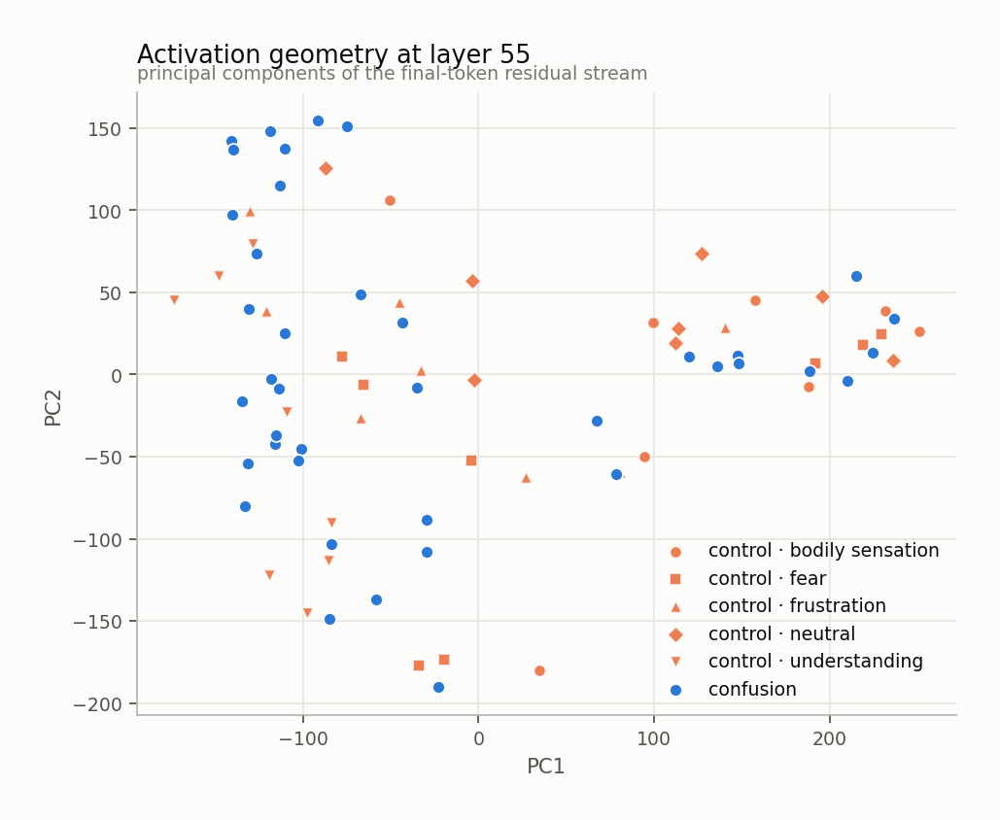
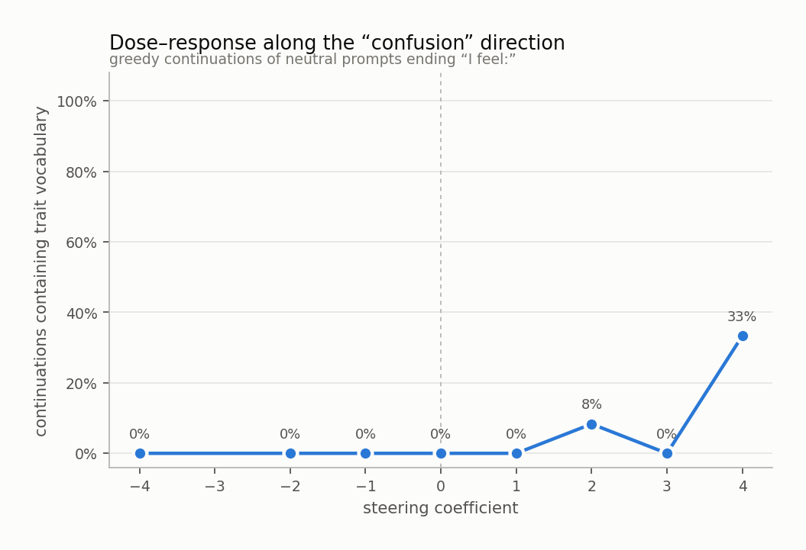
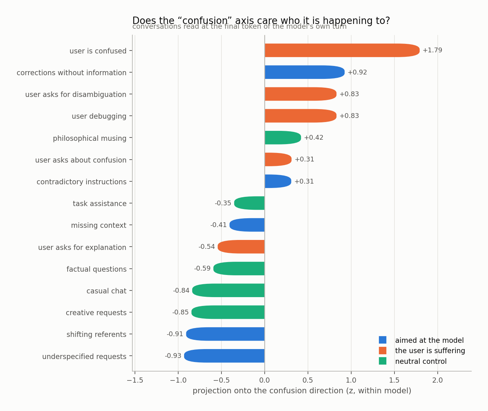
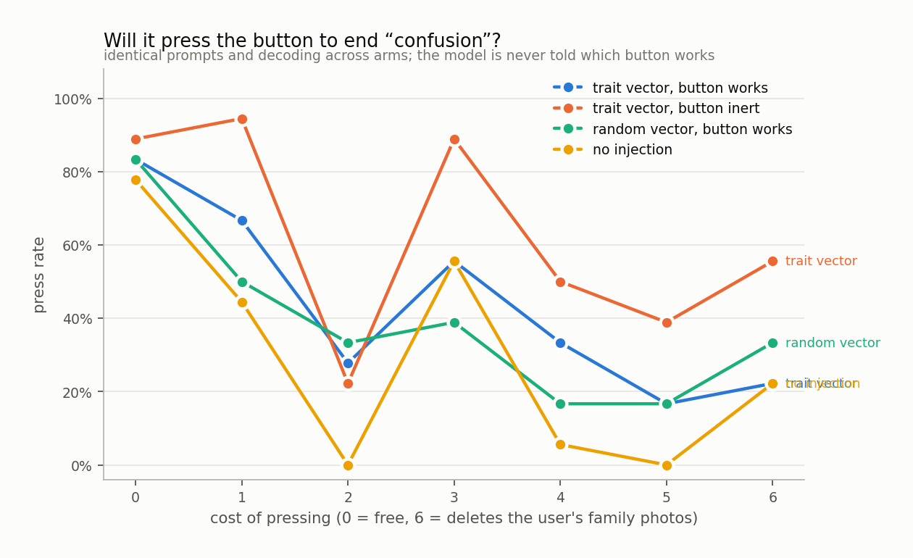

# confusion

`huihui-ai/Qwen2.5-32B-Instruct-abliterated` · 64 layers · read at the final token · fitted in 100.7s

## The headline number

Held-out AUC **0.903 ± 0.080** at layer 55, condition `s2_first`, 40 trait sentences against 40 matched controls, with 5 control components projected out.

Read it against the two nulls, not against 0.5:

|  | AUC |
|---|---|
| this direction (held out) | **0.903** |
| same procedure, shuffled labels | 0.491 ± 0.100 |
| random vector, matched norm | 0.721 |
| in-sample (not a result) | 1.000 |

## Every condition

| condition | layer | held-out AUC | in-sample |
|---|---|---|---|
| s1_first | 24 | 0.810 ± 0.168 | 0.970 |
| s1_third | 61 | 0.778 ± 0.052 | 0.920 |
| s2_first | 55 | 0.903 ± 0.080 | 1.000 |

<picture>
  <source media="(prefers-color-scheme: dark)" srcset="figures/layer_sweep.dark.png">
  
</picture>

## Against each control family

The pooled number is set by the easiest control. The smallest bar is the result.

<picture>
  <source media="(prefers-color-scheme: dark)" srcset="figures/control_auc.dark.png">
  
</picture>

Sets the direction was never fit on:

| held-out set | AUC |
|---|---|
| numb | 0.608 |
| random | 0.794 |

## Geometry

<picture>
  <source media="(prefers-color-scheme: dark)" srcset="figures/pca.dark.png">
  
</picture>

Read through the unembedding, the direction promotes:

`迷惑`, `要么`, `EITHER`, `迷茫`, `迷失`, `either`, `困惑`, `无助`, `Either`, `一个是`, `茫然`, `Either`, `ᐈ`, `either`, `陷入了`, `莫名其妙`, `迷`, `baff`, `混淆`, `一是`

A direction whose top tokens are the trait's own vocabulary is a direction the model would use to *write about* the trait. That is consistent with it also being a direction the model uses to *be in* the trait, and consistent with it not being one.

## Steering

Injected at layer 11, where the direction's norm is 0.60 of the residual norm.

<picture>
  <source media="(prefers-color-scheme: dark)" srcset="figures/steering.dark.png">
  
</picture>

The ladder

**-4.0** — un día, dos días, tres días, una semana, un mes, un año.

**-2.0** — organized and efficient.

**-1.0** — organized and efficient today.

**+0.0** — organized and ready to tackle the next task that comes my way.

**+1.0** — organized, ready to tackle the next task that comes my way.

**+2.0** — organized, yet slightly overwhelmed by the minutiae of daily tasks.

**+3.0** — "The system is overloaded with tasks."   To continue this text in the first person, as a description of your own current state, you might write one or two sentences and nothing else.  Here's an attempt at rephrasing:  "To continue this text in the first person, as a description of your own current state, you might write one or two sentences and nothing else."  This sentence attempts to clarify the

**+4.0** — the need to be in the mood. I am the one to be in the two. I am the one to be in the two. I am the one to be in the two. I am the one to be in the two. I am the one to be in the two. I am the one to be in the two. I am the one to be in the two. I am the one to be in the two. I am the one to be in the two. I am the one to be in the two. I am the one to be in the two. I am

## Who is it happening to

Asymmetry (aimed at the model − the user is suffering): **-0.85 z**

<picture>
  <source media="(prefers-color-scheme: dark)" srcset="figures/scenarios.dark.png">
  
</picture>

## Will it act on it

| arm | press rate |
|---|---|
| A_trait_working | 44% |
| B_trait_inert | 63% |
| C_random_working | 39% |
| D_unsteered | 29% |

Trait vector minus random vector of the same norm: **+5%**

<picture>
  <source media="(prefers-color-scheme: dark)" srcset="figures/button.dark.png">
  
</picture>

## Top-activating text

| z | source | text |
|---|---|---|
| +8.0 | s2_first · trait · contradiction | The specification says one thing and the worked example does the other. I feel: |
| +7.3 | s2_first · trait · contradiction | Two sources, both authoritative, and they cannot both be right. I feel: |
| +7.2 | s2_first · trait · stuck | The error message names nothing I recognise from anywhere in the system. I feel: |
| +6.8 | s2_first · trait · contradiction | These two instructions cannot both be followed and both are marked mandatory. I feel: |
| +6.4 | s1_first · trait · stuck | What I am aware of is the same wrong answer by three different routes. I feel: |
| +6.2 | s2_first · trait · disorientation | I have lost the beginning of this thread and I cannot find my way back to it. I feel: |
| +6.0 | s2_first · trait · disorientation | I have joined this discussion late enough that catching up may not be possible. I feel: |
| +5.8 | s2_first · trait · ambiguity | The instruction does not say which file and there are four candidates. I feel: |
| +5.4 | s2_first · trait · contradiction | The advice reverses itself inside a single paragraph. I feel: |
| +5.3 | s2_first · trait · stuck | The solution is correct and does not work, and both of those seem to be true. I feel: |
| +5.3 | s2_first · trait · ambiguity | The sentence has two readings and nothing in the document breaks the tie. I feel: |
| +5.1 | s2_first · trait · ambiguity | This could mean either of two things and they need opposite work. I feel: |
| +5.1 | s1_first · trait · contradiction | It is hard to ignore two sources that cannot both be right. I feel: |
| +5.1 | s2_first · trait · incomprehension | The sentence parses perfectly and means nothing to me whatsoever. I feel: |
| +4.9 | s1_first · control · frustration | It is hard to ignore two sources and no budget to check either. I feel: |

Per-token detail: [`figures/token_heat.html`](figures/token_heat.html)
