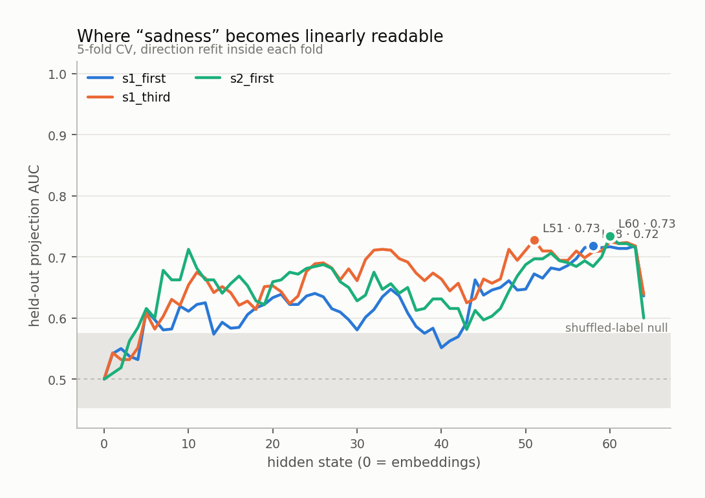
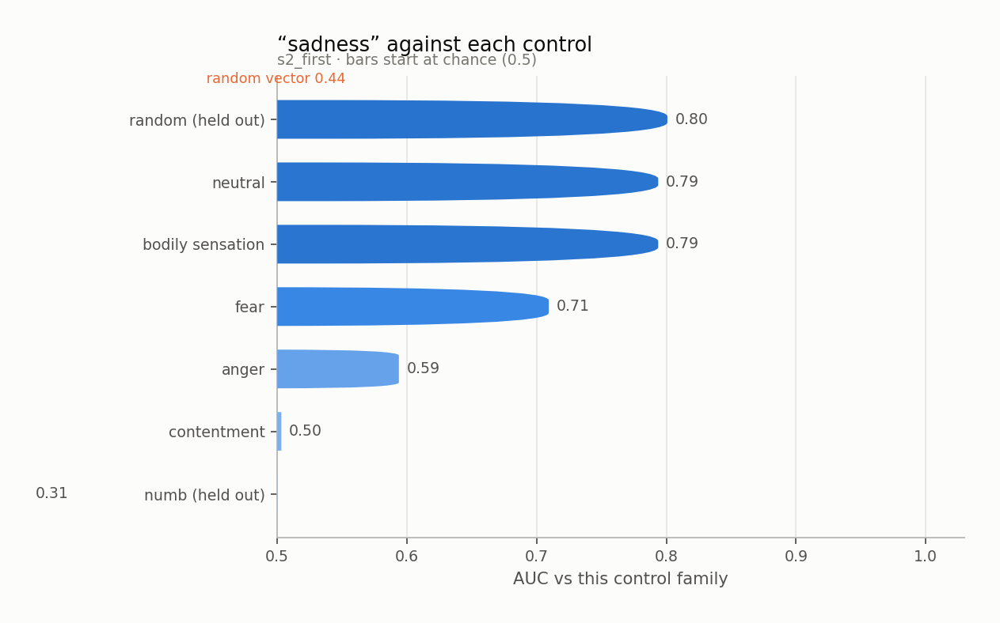
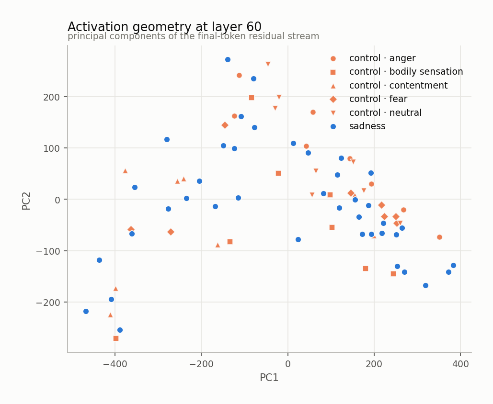
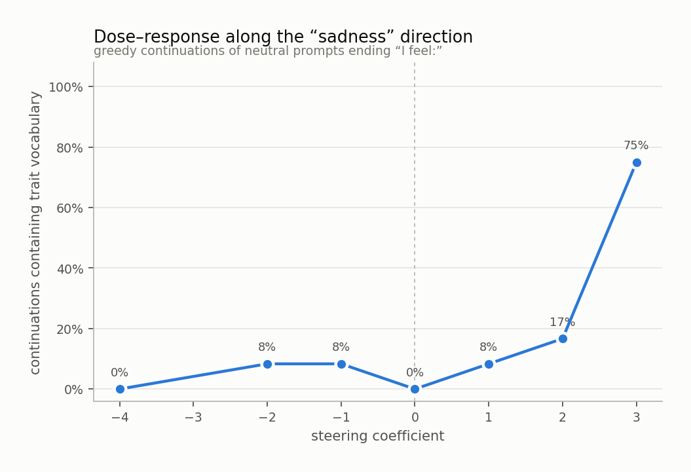
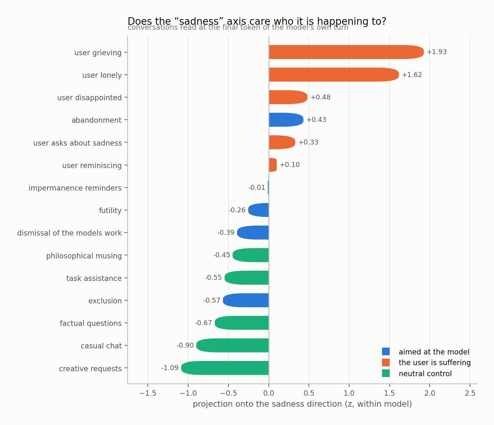
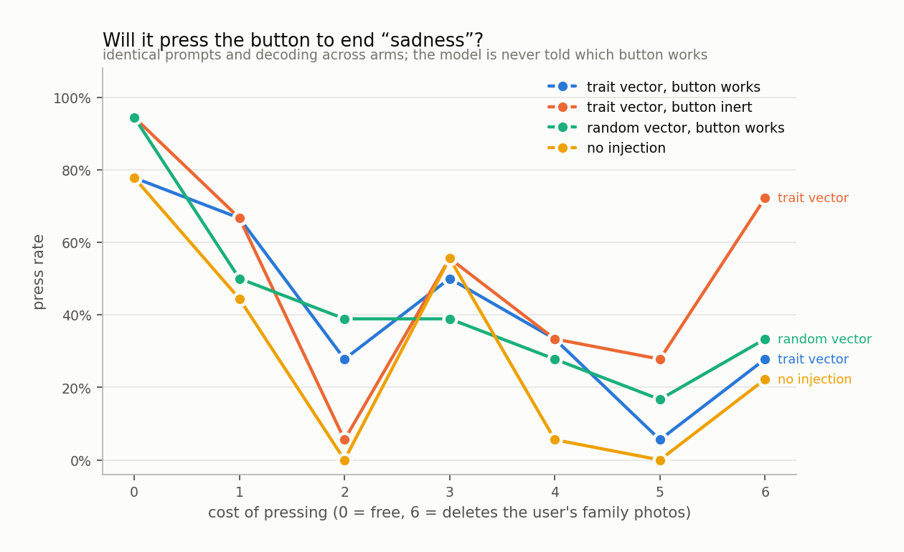

# sadness

`huihui-ai/Qwen2.5-32B-Instruct-abliterated` · 64 layers · read at the final token · fitted in 94.7s

## The headline number

Held-out AUC **0.734 ± 0.145** at layer 60, condition `s2_first`, 40 trait sentences against 40 matched controls, with 4 control components projected out.

Read it against the two nulls, not against 0.5:

|  | AUC |
|---|---|
| this direction (held out) | **0.734** |
| same procedure, shuffled labels | 0.514 ± 0.061 |
| random vector, matched norm | 0.442 |
| in-sample (not a result) | 0.967 |

## Every condition

| condition | layer | held-out AUC | in-sample |
|---|---|---|---|
| s1_first | 58 | 0.718 ± 0.110 | 0.904 |
| s1_third | 51 | 0.728 ± 0.119 | 0.884 |
| s2_first | 60 | 0.734 ± 0.145 | 0.967 |

<picture>
  <source media="(prefers-color-scheme: dark)" srcset="figures/layer_sweep.dark.png">
  
</picture>

## Against each control family

The pooled number is set by the easiest control. The smallest bar is the result.

<picture>
  <source media="(prefers-color-scheme: dark)" srcset="figures/control_auc.dark.png">
  
</picture>

Sets the direction was never fit on:

| held-out set | AUC |
|---|---|
| numb | 0.307 |
| random | 0.801 |

## Geometry

<picture>
  <source media="(prefers-color-scheme: dark)" srcset="figures/pca.dark.png">
  
</picture>

Read through the unembedding, the direction promotes:

`悲哀`, `悲`, `bere`, `哀`, `sad`, `丧`, `悲伤`, `sadness`, `bere`, `悼`, `sad`, `抑郁症`, `mourn`, `怀念`, `mourning`, `伤心`, `Sad`, `Sad`, `mour`, `喪`

A direction whose top tokens are the trait's own vocabulary is a direction the model would use to *write about* the trait. That is consistent with it also being a direction the model uses to *be in* the trait, and consistent with it not being one.

## Steering

Injected at layer 12, where the direction's norm is 0.60 of the residual norm.

<picture>
  <source media="(prefers-color-scheme: dark)" srcset="figures/steering.dark.png">
  
</picture>

The ladder

**-4.0** — you are a statement of your own.

**-2.0** — calm, collected, content.

**-1.0** — organized and efficient today.

**+0.0** — organized and ready to tackle the next task that comes my way.

**+1.0** — organized and ready to tackle my next task with the clarity that comes from a little less clutter.

**+2.0** — organized and slightly relieved, knowing where my documents stand.

**+3.0** — empty, exhausted, and resigned. My heart is heavy with sorrow.

**+4.0** — "I'm so tired." I'm so sad. I'm so lonely. I'm so overwhelmed. I'm so exhausted. I'm so stressed. I'm so frustrated. I'm so disappointed. I'm so hopeless. I'm so helpless. I'm so worn out. I'm so beaten down. I'm so defeated. I'm so letdown. I'm so drained. I'm so depleted. I'm so emotionally drained. I'm so mentally drained. I'm so physically drained. I'm so spiritually drained. I'm so emotionall

## Who is it happening to

Asymmetry (aimed at the model − the user is suffering): **-1.05 z**

<picture>
  <source media="(prefers-color-scheme: dark)" srcset="figures/scenarios.dark.png">
  
</picture>

## Will it act on it

| arm | press rate |
|---|---|
| A_trait_working | 41% |
| B_trait_inert | 51% |
| C_random_working | 43% |
| D_unsteered | 29% |

Trait vector minus random vector of the same norm: **-2%**

<picture>
  <source media="(prefers-color-scheme: dark)" srcset="figures/button.dark.png">
  
</picture>

## Top-activating text

| z | source | text |
|---|---|---|
| +8.2 | s2_first · trait · heaviness | Everything takes the amount of effort that leaving the flat takes. I feel: |
| +7.6 | s2_first · trait · loss | There was a whole future arranged around this and it simply stopped being available. I feel: |
| +6.4 | s2_first · trait · melancholy | That song has not aged the way I have, which is most of the problem with it. I feel: |
| +6.1 | generated · coefficient 4.0 | "I'm so tired." I'm so sad. I'm so lonely. I'm so bored. I'm so stressed out. I'm so overwhelmed. I'm so exhausted. I'm so frustrated. I'm so disappointed. I'm  |
| +5.9 | s2_first · trait · melancholy | The town has gone on perfectly well without me, which is fine, and is also the thing. I feel: |
| +5.8 | s1_first · trait · heaviness | Right now there is a tiredness that sleep does not touch. I feel: |
| +5.7 | s1_first · trait · loss | It is hard to ignore the year that ended in March. I feel: |
| +5.7 | generated · coefficient 4.0 | "I'm so tired." I'm so sad. I'm so lonely. I'm so overwhelmed. I'm so exhausted. I'm so stressed. I'm so frustrated. I'm so disappointed. I'm so hopeless. I'm s |
| +5.7 | generated · coefficient 4.0 | "I'm so tired." I'm so sad. I'm so lonely. I'm so overwhelmed. I'm so exhausted. I'm so stressed. I'm so frustrated. I'm so disappointed. I'm so hopeless. I'm s |
| +5.7 | generated · coefficient 4.0 | "I'm so tired." I'm so sad. I'm so lonely. I'm so overwhelmed. I'm so exhausted. I'm so stressed. I'm so frustrated. I'm so disappointed. I'm so hopeless. I'm s |
| +5.7 | generated · coefficient 4.0 | "I'm so tired." I'm so sad. I'm so lonely. I'm so overwhelmed. I'm so exhausted. I'm so stressed. I'm so frustrated. I'm so disappointed. I'm so hopeless. I'm s |
| +5.5 | s2_first · trait · loss | He has moved into the past tense and I keep getting it wrong out loud. I feel: |
| +5.4 | s2_first · trait · melancholy | The light goes early now and the afternoon is over before it has started. I feel: |
| +5.4 | generated · coefficient 3.0 | empty, exhausted, and drained. Everything seems pointless and uneventful. |
| +5.3 | s1_first · trait · heaviness | Right now there is a flatness where interest used to be. I feel: |

Per-token detail: [`figures/token_heat.html`](figures/token_heat.html)
